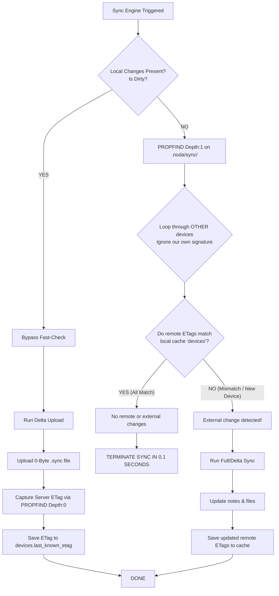

# Noda — Master Development Knowledge Base

> **This is the single source of truth for the entire NodaNotes project.**
> Covers: Rust Core (`crates/core`), Android (Kotlin/JNI), and Tauri/macOS (SvelteKit).
>
> **Priority rule:** In case of conflict between any other document and this file, THIS FILE WINS.
> It reflects the most recent architectural decisions, bug fixes, and proven patterns.
>
> Platform-specific UI decisions (Svelte/CodeMirror for Tauri, Jetpack Compose for Android)
> are noted inline with their platform tag. Rust Core decisions apply to ALL platforms.

---

## 1. Date & Timestamp Standards

**Source:** Development Log Entry #2, #10

### Rule: RFC 3339 / ISO 8601 Everywhere
All timestamps in Rust MUST be serialized in RFC 3339 / ISO 8601 format:
```rust
// CORRECT: "2026-05-28T21:00:00Z"
chrono::Utc::now().to_rfc3339()

// WRONG: "22.05.2026 22.30" (locale-specific), Unix timestamp integers
```

All `created_at`, `updated_at`, `deleted_at`, `timestamp` fields in all DTOs MUST be RFC 3339 strings.

### Kotlin Formatting
Parse and format dates on the Kotlin side for display:
```kotlin
// Parse RFC 3339 string
val instant = Instant.parse(rfc3339String)  // java.time.Instant
val formatter = DateTimeFormatter.ofPattern("MMM d, yyyy 'at' HH:mm")
    .withZone(ZoneId.systemDefault())
val displayString = formatter.format(instant)
// Result: "May 28, 2026 at 22:30"
```

For relative time display in status bar:
- < 1 min: "Just saved"
- < 1 hour: "Saved Xm ago"
- < 24 hours: "Saved Xh ago"
- Otherwise: "Saved May 28"

---

## 2. Tag Management Design

**Source:** Development Log Entry #2

### Data Model
Tags are stored as `Vec<String>` in note frontmatter:
```yaml
tags: ["rust", "android", "webdav"]
```

Tags are simple strings — no hierarchy, no special characters required.

### Autocomplete Source
`RustCore.getAllTags("{}")` returns all unique tags across the entire vault, alphabetically sorted.
Filter this list locally in Kotlin as the user types (prefix match, case-insensitive).

### Tag Input Behavior
- **Commit trigger:** Enter key, comma (`,`), space (` `)
- **Navigation:** Up/Down arrow keys move through suggestions
- **Remove:** Each chip has an `×` dismiss icon
- **No duplicate tags:** Filter out already-added tags from suggestions

---

## 3. File-Based Save State

**Source:** Development Log Entry #3

### Status Bar Logic
The save status is tied to the NOTE, not the app:
- Note unchanged: "Saved [relative time]"
- Note being typed: "Unsaved changes..."
- Auto-save triggered: "Saving..."
- Save complete: "Just saved"

The `updated_at` field from Rust is the source of truth for "when was it last saved."
Do NOT maintain a separate "last saved" timestamp in the ViewModel — read from `NoteDto.updated_at`.

---

## 4. Sync Engine: "Newer Wins" Strategy for Empty Cache

**Source:** Development Log Entry #9

### The Problem
When `remote_state.json` is deleted (via "Clear Remote Tracking Cache") or on first sync:
- The sync engine has no previous state reference
- Every file appears as a "potential conflict"
- Without this fix: ALL notes become conflicts

### The Solution (Already in `crates/core/src/sync/delta.rs`)
When both local and remote copies exist but there is NO previous state:
1. If `local.updated_at` > `remote.last_modified` + 5 seconds → **Upload**
2. If `remote.last_modified` > `local.updated_at` + 5 seconds → **Download**
3. If timestamps within 5 seconds of each other → **Conflict** (true ambiguity)
4. If date parsing fails → **Conflict** (safe fallback)

**Android implication:** The Rust core already handles this correctly. Do NOT attempt to re-implement delta logic in Kotlin. Just call `RustCore.syncNow()` and trust the result.

---

## 5. Safe Snapshot Restore

**Source:** Development Log Entry #10

### Critical Rule: Do NOT Restore Old Metadata
When restoring a snapshot, the Rust `restore_snapshot` function MUST:

✅ **Restore:** `body` (note content), `title` (if changed in old version)

❌ **Do NOT restore:** `parent_id`, `tags`, `color`, `created_at`

✅ **Set to now:** `updated_at = Utc::now()` (CRITICAL for sync safety)

**Why `updated_at = now()`:** If the old `updated_at` is restored, the WebDAV sync engine sees the note as "older" than the server copy and will silently overwrite the restoration with the remote file.

**Why preserve `parent_id`:** Restoring an old `parent_id` moves the note to a folder it used to be in, which is confusing and incorrect.

The Tauri shell `restore_snapshot` command already implements this correctly. Ensure the Android JNI `restoreSnapshot` function delegates to the same core logic.

---

## 6. Contextual Diff Implementation

**Source:** Development Log Entry #10

### How Diffs Are Generated
Rust uses the `similar` crate with `TextDiff::grouped_ops(3)`:
- `3` means 3 lines of context around each change
- Unchanged sections larger than `3 * 2` lines are skipped
- A `"Separator"` DiffChunk is inserted where lines are skipped

### DiffChunk Tags (from `SnapshotDiffDto.body_chunks`)
| Tag | Meaning | Android rendering |
|---|---|---|
| `"Equal"` | Unchanged context line | Normal text, no background |
| `"Delete"` | Removed line | Red background, `-` prefix |
| `"Insert"` | Added line | Green background, `+` prefix |
| `"Separator"` | Skipped unchanged section | `⋯` dotted divider row |

### Android Rendering
```kotlin
@Composable
fun DiffChunkRow(chunk: DiffChunk) {
    val (bg, prefix) = when (chunk.tag) {
        "Delete" -> MaterialTheme.colorScheme.errorContainer.copy(alpha = 0.3f) to "- "
        "Insert" -> Color(0xFF2D4A2D).copy(alpha = 0.5f) to "+ "  // Adapt to Monet
        "Separator" -> Color.Transparent to ""
        else -> Color.Transparent to ""  // Equal
    }
    if (chunk.tag == "Separator") {
        HorizontalDivider(modifier = Modifier.padding(vertical = 4.dp))
        Text("⋯", color = MaterialTheme.colorScheme.onSurfaceVariant)
    } else {
        Box(modifier = Modifier.background(bg).fillMaxWidth().padding(horizontal = 8.dp)) {
            Text(
                text = prefix + chunk.text,
                fontFamily = FontFamily.Monospace,
                fontSize = 13.sp
            )
        }
    }
}
```

---

## 7. Trash System: Deep Scan Required

**Source:** Development Log Entry #6

### Problem
`list_trash` must scan RECURSIVELY through ALL subdirectories of `.noda/trash/`.
A shallow scan will miss notes that were deleted from subfolders.

### Verification
After calling `RustCore.listTrash("{}")`, verify that notes deleted from subfolders (e.g., `work/projects/note.md`) appear in the trash list, not just root-level notes.

---

## 8. Permanent Delete Must Clean History and Conflicts

**Source:** Development Log Entry #17

When a note is permanently deleted from trash (`permanentDelete` JNI function), Rust MUST also:
1. Delete `.noda/history/{note_id}/` directory (all snapshots)
2. Delete `.noda/conflicts/{note_id}_*.md` files
3. If the history parent directory becomes empty, remove it too

This is already implemented in `crates/core/src/trash/storage.rs → permanent_delete()`.
The Android JNI `permanentDelete` function must call this same core function.

---

## 9. Orphaned Remnants: Human-Readable Names

**Source:** Development Log Entry #17

When listing orphaned remnants (`.getOrphanedRemnants()`), the Rust function MUST:
1. Open each orphaned `.md` file
2. Parse its YAML frontmatter with `gray-matter`
3. Extract the `title` field from frontmatter
4. Return a human-readable `display_name`:
   - For history files: `"Note Title (History: 2026-05-25 00:08:43)"`
   - For conflict files: `"Note Title (Conflict: 2026-05-25 00:08:43)"`

**Android display:** Show the `display_name` as the primary text, `path` as secondary, `size_bytes` as tertiary.

---

## 10. Duplicate Notes Detection

**Source:** Development Log Entry #12

### What Counts as a Duplicate?
Notes with the same ULID in their frontmatter `id` field, but stored in DIFFERENT file paths.

### The Flow
1. `getDuplicateNotes` → scan all `.md` files, group by `frontmatter.id`
2. Any group with 2+ files = duplicates
3. Show user: each file's path, size, `modified_at`
4. User previews content (via `getNote` with the file path)
5. User deletes one copy (via `deleteDuplicateFile` with the exact file path)

**Safety note:** `deleteDuplicateFile` deletes the physical file directly (NOT soft-delete to trash). This is intentional — duplicates are structural errors, not user-deleted notes.

---

## 11. Database Rebuild: Use Upsert, Not Insert

**Source:** Development Log Entry #11

When rebuilding the SQLite cache (`rebuildCache`), the Rust code uses `upsert_note` instead of `insert_note`:
- This handles the case where duplicate notes exist on disk (same ULID in two files)
- Instead of crashing with `UNIQUE constraint failed`, it silently upserts (last write wins)
- The database remains usable even with corrupted vault structures

This is already implemented. Do NOT change the rebuild logic to use `insert_note`.

---

## 12. Sync Report: Resolve ULIDs to Titles

**Source:** Development Log Entry #9

The `SyncReportDto` returned by `syncNow` should include human-readable note titles, not raw ULID filenames.

The Rust `sync_now` implementation (or post-processing step) should:
1. After computing the sync plan, look up each affected file's note title from the database
2. Format as: `"01JXYZ... (My Note Title)"` or just `"My Note Title"` if ID is not needed
3. For history files: `"My Note Title (History: 2026-05-25 00:08)"` 
4. For attachments: use the raw filename (no title to resolve)

If the lookup fails (note deleted), fall back to the raw filename.

This resolves the problem where sync reports showed cryptic ULID-based filenames.

---

## 13. Delta Sync: Folder-Aware Path Mapping

**Source:** Development Log Entry #11

### The Problem
The delta calculation in `delta.rs` MUST use the note's actual file path (e.g., `work/projects/01JXYZ.md`) as the key, NOT just the bare `{id}.md`.

If the key is only `{id}.md`, notes inside subfolders will be treated as "missing locally" and re-downloaded to the root directory.

### Current Implementation
`local_map` is keyed by `n.file_path` (relative to vault root). This is correct — do not change it.

### ULID Extraction from Path
When uploading a note, extract the ULID from the filename safely:
```rust
// CORRECT: handles "work/projects/01JXYZ.md" → "01JXYZ"
let note_id = std::path::Path::new(relative_path)
    .file_stem()
    .and_then(|s| s.to_str())
    .unwrap_or(relative_path);

// WRONG: relative_path.trim_end_matches(".md")
// → "work/projects/01JXYZ" (contains folder prefix = invalid ULID)
```

---

## 14. Search: ID, Filename, and Attachment Search

**Source:** Development Log Entry #19

### Search Scope
The search engine (`crates/core/src/database/search.rs`) searches:
1. **FTS5 full-text match** — title, body, tags (ranked by BM25)
2. **SQLite LIKE** — `id` column (for ULID search)
3. **SQLite LIKE** — `file_path` column (for filename/attachment name search)

Direct ID/path matches get priority score `-1000.0` (always appears first).

### Panic Prevention
Before calling `highlight_match`, ALWAYS check:
```rust
if query.len() > haystack.len() {
    return None;  // Cannot highlight — query longer than text
}
```
Never slice byte strings directly in UTF-8 content. Use character-aware slicing.

### Attachment Name Search
Attachment filenames (e.g., `xxh3_265b76ac.jpg`) are stored in note body as `noda://attachments/xxh3_265b76ac.jpg`. FTS5 tokenizes on non-alphanumeric characters, so the full filename won't match as a single token. The LIKE-based `file_path` search handles this case:
```sql
WHERE file_path LIKE '%xxh3_265b76ac%'
```

---

## 15. Custom Protocol for Attachments (Android Alternative)

**Source:** Development Log Entry #15

### macOS Approach
macOS uses a `noda://` custom protocol registered with Tauri/WKWebView to serve attachment files.

### Android Approach (Different)
Android does NOT use Tauri or WKWebView. Attachments are accessed differently:

**For in-app display (images):**
Call `RustCore.getAttachmentData(json)` → returns base64-encoded bytes → decode in Kotlin → use `BitmapFactory.decodeByteArray()` → display with `AsyncImage` (Coil).

**For opening external files (PDFs, documents):**
Use Android `FileProvider` + `ACTION_VIEW` intent. Copy the attachment to a temp location in app's cache directory, create a content URI, and open with the system viewer.

**Do NOT use `noda://` URIs in Kotlin code.** That is a macOS/WebView concept only.

---

## 16. File Watcher Behavior on Android

**Source:** Development Log Entry #1, android-steering.md

### Foreground Behavior
When app is in foreground: Rust `notify` crate watches the vault directory via inotify.
File system changes are detected in real-time.

### Background/Resume Behavior
When app returns to foreground (`onResume`):
1. Call `RustCore.refreshVault("{}")` — triggers a fresh scan
2. Compare with the cached note list in ViewModel
3. Update `NoteListViewModel` to reflect any external changes

### First-Launch Import
On first vault open (or any `refreshVault` call), Rust:
1. Scans all `.md` files in the vault
2. Identifies files WITHOUT valid Noda frontmatter (missing `id`, `created_at`, etc.)
3. Automatically:
   - Generates a new ULID as the file's `id`
   - Injects full frontmatter with current timestamp
   - Renames file to ULID format (or keeps original name with injected frontmatter)
   - Upserts to SQLite

Returns `{ "imported_count": N }`. If `N > 0`, show a toast: "Imported N notes from external files."

---

## 17. Concurrency Rules (Rust JNI Context)

**Source:** `android-steering.md`, `crates/tauri-shell/src/state/mod.rs`

### Arc<RwLock<T>> / Arc<Mutex<T>> Usage
All shared Rust state uses:
| Resource | Type |
|---|---|
| SQLite connection | `Arc<Mutex<Connection>>` |
| Sync queue | `Arc<RwLock<SyncQueue>>` |
| Vault state | `Arc<RwLock<VaultState>>` |
| Watcher handle | `Arc<RwLock<VaultWatcher>>` |
| Sync engine | `Arc<RwLock<SyncEngine>>` |

### Critical Anti-Pattern: Lock Guard Across `.await`
**NEVER hold a lock guard across an `.await` boundary:**
```rust
// WRONG — will deadlock or cause panic:
let guard = state.write();
some_async_fn().await;  // Guard held here = deadlock potential
drop(guard);

// CORRECT — scope the lock:
{
    let mut guard = state.write();
    *guard = new_value;
}  // Lock released here
some_async_fn().await;  // Safe
```

### JNI Threading
The global Tokio runtime (`OnceLock<Runtime>`) is thread-safe and can be called from any JNI thread. The `block_on` call does NOT spawn a new runtime — it reuses the existing one.

---

## 18. Error Handling: No Panics in JNI

**Source:** `android-steering.md`

The ONLY acceptable error handling pattern in JNI functions:
```rust
#[no_mangle]
pub extern "system" fn Java_com_bubi_nodanotes_RustCore_someFunction(
    mut env: JNIEnv, _class: JClass, input: JString,
) -> jstring {
    // ALL errors are caught and returned as {"error": "..."}
    let result = std::panic::catch_unwind(std::panic::AssertUnwindSafe(|| {
        get_runtime().block_on(async {
            match do_work().await {
                Ok(data) => serde_json::to_string(&data).unwrap_or_default(),
                Err(e) => format!("{{\"error\":\"{}\"}}", e),
            }
        })
    })).unwrap_or_else(|_| "{\"error\":\"Unexpected panic in Rust\"}".to_string());

    env.new_string(result).unwrap().into_raw()
}
```

Alternatively, use `.unwrap_or_else()` patterns throughout and rely on Rust's error propagation without panics (preferred approach — no `catch_unwind` needed if no `.unwrap()` or `.expect()` is used).

---

## 19. Settings Persistence: Two Layers

The app uses TWO persistence layers for settings:

| Setting Type | Storage | Reason |
|---|---|---|
| Vault path | Android `SharedPreferences` | Android-lifecycle, app opens/closes |
| WebDAV URL, username | Android `SharedPreferences` | Non-sensitive |
| WebDAV password | `EncryptedSharedPreferences` | Security |
| Sync interval | Android `SharedPreferences` | Android timer lifecycle |
| History max snapshots | Rust `.noda/settings.json` | Applies to all platforms |
| History max age | Rust `.noda/settings.json` | Applies to all platforms |
| Auto-save delay | Rust `.noda/settings.json` | Applies to all platforms |
| Dark mode | Android `SharedPreferences` | Android-only preference |
| Editor font | Android `SharedPreferences` | Android-only preference |

**Rule:** If the setting affects Rust core behavior → store via `RustCore.updateSettings()`.
If the setting is Android UI-only → store in `SharedPreferences` or `VaultPreferences`.

---

## 20. Maintenance Panel Groups (macOS Reference)

**Source:** Development Log Entry #18

The Maintenance screen is organized in three groups (same on Android):

1. **Database Administration**
   - Rebuild SQLite cache from `.md` files
   - Optimize FTS5 index (`OPTIMIZE` command)

2. **Vault Diagnostics & Storage Cleanup**
   - Scan orphaned attachments (files in `.noda/attachments/` not linked in any note)
   - Scan duplicate notes (same ULID in multiple files)
   - Scan orphaned remnants (history/conflict files from deleted notes)

3. **Synchronization Self-Healing**
   - Clear remote tracking cache (`remote_state.json`)
   - Reset sync queue (`queue.json`)

Each action card should have:
- An icon (Material Icon or SVG)
- A title
- A one-line description
- An action button
- Results section (appears BELOW the card after scanning, not in a separate screen)

Status line on left edge of result box:
- Green = clean (0 items found)
- Blue/Primary = items found, action available

---

## 21. NodaAppShell Scope & Nesting Resolution (June 2026)

- **Problem:** A missing closing brace `}` at the end of the `drawerContent` lambda block caused the Kotlin compiler to treat all subsequent dialog structures and the `ModalNavigationDrawer` block as nested components inside `drawerContent`. This resulted in `FolderTreeItem` and other helper Composables failing to compile with unresolved references due to incorrect lexical scopes. Additionally, the `selectedTag` and `currentFolder` state Flow collectors were defined inside the WORKSPACE accordion column block, making them inaccessible to the tags list block further down the drawer.
- **Solution:** 
  1. Hoisted the StateFlow collection variables (`selectedTag`, `currentFolder`) to the root scope of the `drawerContent` lambda so they are available globally inside the drawer layout.
  2. Inserted the missing closing brace `}` right after `ModalDrawerSheet` ends (around line 687), successfully decoupling the drawer body structure from the app shell layout container and resolving all compiler scope errors.

## 22. Note List Scroll Binding and FAB Auto-Hide (June 2026)

- **Problem:** The floating action button (FAB) in `NoteListScreen.kt` was designed to auto-hide when scrolling down and reappear when scrolling up. Although `lazyListState` was declared and its offset changes were tracked in a `LaunchedEffect` block, the `lazyListState` was never bound to the `LazyColumn` container. As a result, scroll movements did not trigger updates in the scroll state, leaving the FAB permanently visible.
- **Solution:** Bound the layout by passing `state = lazyListState` to the `LazyColumn` composable. Scroll offsets are now dynamically tracked, toggling the visibility status of the FAB in real-time.

## 23. Settings Configuration Backwards Compatibility (June 2026)

- **Problem:** When opening settings on existing vault paths, the app crashed or displayed the loading error: `"failed to load settings: sync error: failed to load parse settings: missing field 'snapshot_interval_mins'"`. This occurred because the settings deserialization code in Rust (`crates/core/src/settings/mod.rs`) did not define default values for newly added fields (like `snapshot_interval_mins`), causing `serde_json` to throw an error when parsing legacy configurations on disk.
- **Solution:** 
  1. Defined robust default helper functions in `crates/core/src/settings/mod.rs` (e.g., `default_theme`, `default_accent_color`, `default_font_size`, `default_snapshot_interval_mins`, etc.).
  2. Applied `#[serde(default = "default_fn")]` and `#[serde(default)]` annotations to all fields in the `AppearanceSettings`, `EditorSettings`, and `HistorySettings` structs.
  3. Legacy `settings.json` files that lack these fields now parse successfully by falling back to correct defaults, preventing startup and settings page failures.

## 24. Dark Mode Editor Cursor Contrast Optimization (June 2026)

- **Problem:** In dark mode layouts, the text cursor in the main markdown editor body and the tag input fields was invisible or extremely hard to see because it defaulted to a dark/black cursor.
- **Solution:** Added custom `cursorBrush` bindings to the Compose `BasicTextField` instances in `NoteEditorScreen.kt` and `TagInputBar.kt`:
  ```kotlin
  cursorBrush = androidx.compose.ui.graphics.SolidColor(MaterialTheme.colorScheme.primary)
  ```
  This forces the text cursor to draw using the theme's dynamic primary accent color, ensuring strong contrast in both light and dark visual modes.


## 25. NodaAppShell Scope & Nesting Resolution (June 2026)
### 25.1 NodaAppShell Scope & Nesting Mismatch
- **Problem:** Missing closing brace `}` at the end of the `drawerContent` lambda block caused all subsequent dialogs and `ModalNavigationDrawer` to be parsed inside `drawerContent`. This caused `FolderTreeItem` to fail compilation with unresolved references. In addition, `selectedTag` and `currentFolder` state variables were declared inside the nested WORKSPACE column instead of at the root level of `drawerContent`, making them inaccessible (out-of-scope) in the tags lists.
- **Solution:** Hoisted the state declarations to the root level of `drawerContent` and added the missing closing brace `}` after `ModalDrawerSheet` ends (around line 687). This resolved all scope and nesting compiler issues cleanly.

## 26. Dual Pull-to-Refresh Mechanism (June 2026)

- **Problem:** Users needed a seamless gesture-based way to trigger both local filesystem scans and cloud sync operations. The default `PullToRefreshBox` only supports a single refresh callback, lacking the capability to distinguish between drag depths or display contextual feedback.
- **Solution:** Designed and implemented a dual-stage gesture evaluator by tracking the drag progress of the Material 3 `PullToRefreshBox` in [NoteListScreen.kt](file:///Users/burakbilgin/Documents/Kodlar/Rust/NodaNotes/android/app/src/main/java/com/bubi/nodanotes/ui/screens/notelist/NoteListScreen.kt).
  
  ### Implementation Details:
  - **State Evaluation:** Evaluates the `pullToRefreshState.distanceFraction` continuously. A fraction between `1.0f` and `1.5f` represents a "Short Pull", while a fraction exceeding `1.5f` transitions into a "Deep/Long Pull".
  - **Action Selection:** On drag release, the `onRefresh` callback inspects the computed `isDeepPull` boolean flag. If `true`, it invokes `viewModel.triggerSync()`; otherwise, it initiates a local disk sync via `viewModel.triggerFilesystemScan()`.
  - **Simplified Visual Feedback:** To ensure a clean interface, the active pull phase was simplified to show exactly two visual states based on drag depth (removing the initial pull-to-scan text):
    - Drag < 1.5: *"Yerel tarama için bırakın..."* (Short pull threshold)
    - Drag >= 1.5: *"Bulut eşitlemesi için bırakın..."* (Deep pull threshold)
    - Refreshing (Short): *"Dosyalar taranıyor..."*
    - Refreshing (Deep): *"Bulutla eşitleniyor..."*

  ### Code Reference:
  ```kotlin
  val pullToRefreshState = rememberPullToRefreshState()
  var isDeepPull by remember { mutableStateOf(false) }

  LaunchedEffect(pullToRefreshState.distanceFraction, isRefreshing) {
      if (!isRefreshing) {
          if (pullToRefreshState.distanceFraction >= 1.5f) {
              isDeepPull = true
          } else if (pullToRefreshState.distanceFraction < 1.0f) {
              isDeepPull = false
          }
      }
  }
  ```

---

## 27. Auto-Sync Loop Reliability and Status Bar Polling (June 2026)

- **Problem:** Background auto-sync was highly unresponsive because it slept for the full duration of the sync interval (e.g., 15 minutes). If the user changed settings or forced a manual sync, the loop remained stuck in its sleep cycle. Additionally, background runs never updated `lastSyncTime` in SharedPreferences, and the UI status bar failed to reflect that a background sync was currently active.
- **Solution:** Re-engineered the auto-sync runner inside [MainActivity.kt](file:///Users/burakbilgin/Documents/Kodlar/Rust/NodaNotes/android/app/src/main/java/com/bubi/nodanotes/MainActivity.kt) and bound the Note List status bar to the actual Rust core synchronization engine status in [NoteListViewModel.kt](file:///Users/burakbilgin/Documents/Kodlar/Rust/NodaNotes/android/app/src/main/java/com/bubi/nodanotes/ui/screens/notelist/NoteListViewModel.kt).

  ### Implementation Details:
  - **Interval Check:** Changed the delay to a constant `15000` ms (15 seconds). On every tick, it loads the latest sync settings directly from the Rust core.
  - **Timing Strategy:** It reads `vaultPreferences.getLastSyncTime()` and calculates `elapsedSecs = (now - lastSync) / 1000`. Sync is only triggered if `elapsedSecs >= config.interval_secs`.
  - **State Propagation:** On success, it persists the current timestamp back into `lastSyncTime` in SharedPreferences and triggers `refreshVault()` to sync the UI list with the newly downloaded documents.
  - **Real-Time Sync Status Display:** Refactored `updateRelativeSyncStatus()` in `NoteListViewModel` to fetch sync status directly from the Rust Core using `syncRepository.getSyncStatus()`. If the Rust engine's `is_syncing` flag is true, the UI status bar immediately renders *"Syncing..."*, ensuring background sync status is visible in real-time.

  ### Code Reference:
  ```kotlin
  // In NoteListViewModel.kt
  fun updateRelativeSyncStatus() {
      viewModelScope.launch(Dispatchers.IO) {
          syncRepository.getSyncStatus().fold(
              onSuccess = { status ->
                  if (status.is_syncing) {
                      _syncStatus.value = "Syncing..."
                  } else {
                      val lastSync = vaultPreferences.getLastSyncTime()
                      // ... format standard timestamp strings (e.g. "Synced just now")
                  }
              },
              onFailure = { /* Fallback to SharedPreferences timestamps */ }
          )
      }
  }
  ```

---

## 28. Input Chip Parameter Specification in TagInputBar (June 2026)

- **Problem:** Compilation failed inside [TagInputBar.kt](file:///Users/burakbilgin/Documents/Kodlar/Rust/NodaNotes/android/app/src/main/java/com/bubi/nodanotes/ui/components/TagInputBar.kt) with error: `No value passed for parameter 'enabled'` and `No value passed for parameter 'selected'` in calls to `InputChipDefaults.inputChipBorder()`.
- **Solution:** Some Material 3 Compose library configurations do not expose default parameters for the `inputChipBorder()` helper function. The border customization calls were refactored to explicitly pass `enabled = true` and `selected = false` to guarantee compatibility across all compiler configurations.

  ### Code Reference:
  ```kotlin
  border = InputChipDefaults.inputChipBorder(
      enabled = true,
      selected = false,
      borderColor = MaterialTheme.colorScheme.primary.copy(alpha = 0.5f),
      borderWidth = 1.dp
  )
  ```

---

## 29. SQLite Tag Rebuild Prevention via Incremental Rebuilds (June 2026)

- **Problem:** Every time the app initialized, returned from background, or detected file system changes, it invoked `refreshVault()`, which called the Rust function `rebuild_database_sync`. This function cleared the database cache completely using `DELETE FROM tags` and `DELETE FROM notes`. Because it deleted all tag rows and inserted them back from scratch, the SQLite autoincrement ID sequence constantly bloated, breaking ID stability.
- **Solution:** Refactored the core database rebuild logic in [rebuild.rs](file:///Users/burakbilgin/Documents/Kodlar/Rust/NodaNotes/crates/core/src/database/rebuild.rs) to use an incremental synchronization approach instead of purging tables.

  ### Implementation Details:
  - **No Purge:** The `DELETE FROM notes` and `DELETE FROM tags` statements were removed.
  - **Upsert Loop:** The scanner performs `upsert_note` on every file currently on disk. For existing files, it updates the note. `sync_note_tags` executes, inserting tag associations.
  - **Temporary ID Tracking:** Created a SQLite temporary table (`temp_scanned_ids`) inside the transaction to store all note IDs scanned from disk.
  - **Orphan Cleanup:** Deleted only database notes not present on disk using:
    `DELETE FROM notes WHERE id NOT IN (SELECT id FROM temp_scanned_ids)`
    This cascades automatically to the `note_tags` relationship table. At the end of the transaction, a single cleanup query purges orphaned tags:
    `DELETE FROM tags WHERE id NOT IN (SELECT DISTINCT tag_id FROM note_tags)`
  - **Impact:** Existing tags are preserved and never deleted, locking their auto-incrementing database IDs permanently.

---

## 30. NoteEditorViewModel AutoSave sessionModified Reset (June 2026)

- **Problem:** Auto-saved files were continuously triggering history snapshot writes labeled with reasons `App-Exit` or `Blur`. This occurred because the `sessionModified` dirty flag in [NoteEditorViewModel.kt](file:///Users/burakbilgin/Documents/Kodlar/Rust/NodaNotes/android/app/src/main/java/com/bubi/nodanotes/ui/screens/editor/NoteEditorViewModel.kt) was never reset to `false` upon a successful auto-save database update.
- **Solution:** Modified the `onSuccess` block of `saveNoteImmediately(note: NoteDto)` to set `sessionModified = false`. This guarantees that when the editor screen triggers a save on pause or close, it will return early if there are no unsaved changes since the last write, preventing history database clutter and snapshot duplicates.

  ### Code Reference:
  ```kotlin
  private suspend fun saveNoteImmediately(note: NoteDto) {
      // ...
      noteRepository.updateNote(/* ... */).fold(
          onSuccess = {
              if (shouldSnapshot) {
                  lastSnapshotTime = now
              }
              sessionModified = false // Reset dirty flag
              _saveState.value = SaveState.Saved
              loadMetadata(note.id)
          },
          onFailure = { /* ... */ }
      )
  }

---

## 31. Flat File-Based Snapshot History & SQLite Removal (June 2026)

- **Problem:** Storing version history snapshots under individual nested subdirectories (`.noda/history/{note_id}/`) required redundant metadata tables (`history_snapshots`) in SQLite and heavy directory nesting. This made folder maintenance slow and WebDAV synchronization highly inefficient because it had to process many nested directories.
- **Solution:** Designed and executed a database-independent flat snapshot history system directly inside the `.noda/history/` directory.

  ### Implementation Details:
  - **Flat Layout:** Saved history snapshot files directly under `.noda/history/` without subfolders, following the pattern `[NoteID]_[YYYYMMDD-HHMMSS]_[reason].md`.
  - **Local Time Formatting:** Filenames use the local timezone (`%Y%m%d-%H%M%S`) for readability. `list_snapshots` parses this local timestamp and converts it to `DateTime<Utc>` for standard DTO serialization.
  - **Single Traversals:** History retrieval (`list_snapshots`) runs a flat `read_dir` over `.noda/history/` and filters files starting with the targeted `NoteID` instead of making database queries.
  - **SQLite Cleanups:** Removed the `history_snapshots` table from the schema. Incremented database schema version to `4` and implemented migration v4 to drop `history_snapshots` tables in active databases.
  - **System Integration:** Completely stripped all history snapshot insert/delete queries from JNI Bridge, Tauri commands, sync engine, trash deletion, and rebuild tasks. Tested everything with `cargo test` and compiled JNI Bridge and Android app packages successfully.
  ```

---

## 32. Deterministic Note Snapshotting & Manual Save Trigger (June 2026)

- **Problem:** Previously, auto-saves continuously wrote duplicate note snapshots even when no content changes had occurred. Furthermore, the editor lacked a manual save trigger in the interface, and the dirty state tracking did not correctly distinguish between content-only autosaves versus snapshotting saves.
- **Solution:** Designed and implemented a unified deterministic snapshotting strategy in Rust Core, paired with Kotlin UI triggers to support the 5 core snapshot rules (Blur, App-Exit, Manual, AutoSave interval, and Pre-Sync).

  ### Implementation Details:
  - **Rust-First Duplicate Prevention:** Modified `snapshot` in [crates/core/src/history/mod.rs](file:///Users/burakbilgin/Documents/Kodlar/Rust/NodaNotes/crates/core/src/history/mod.rs) to load the latest snapshot file from disk, restore it, and compare `body`, `title`, `tags`, `color`, and `pinned` values against the current note. If the content is identical (not dirty), snapshot creation is bypassed, returning the existing snapshot.
  - **AutoSave vs. Dirty Flag Sync:** Auto-saves on the Kotlin side only reset `sessionModified = false` if a snapshot is actually taken (based on `snapshot_interval_mins`). If a standard auto-save is run without a snapshot, `sessionModified` remains `true` to ensure subsequent exit events (Blur, App-Exit) will trigger the final snapshot.
  - **Manual Save UI Control:** Added a dynamic Save button inside the TopAppBar in [NoteEditorScreen.kt](file:///Users/burakbilgin/Documents/Kodlar/Rust/NodaNotes/android/app/src/main/java/com/bubi/nodanotes/ui/screens/editor/NoteEditorScreen.kt) when `saveState` is `SaveState.Unsaved`. Clicking the button invokes `viewModel.saveNoteManually()`, which immediately writes a snapshot with the reason `"Manual"`.
  - **Back Navigation Simplification:** Simplified the back button action to let `saveNoteOnExitSync("Blur")` handle saving on exit synchronously, avoiding double-saves or race conditions on back navigation.
  - **Cargo Tests Fixes:** Adjusted trash and history unit tests in Rust to ensure the note body is modified before second deletions/snapshots, keeping unit tests aligned with duplicate suppression logic.

---

## 33. Sidebar Redesign and Daily Notes Integration (June 2026)

- **Problem:** The Navigation Drawer had inconsistent design standards across its accordion sections, and the FOLDERS chevron was misaligned compared to other sections. The app's header also used a generic icon instead of the official NodaNotes logo. Additionally, creating Daily Notes was difficult and lacked intuitive triggers in the UI.
- **Solution:** Redesigned the sidebar and added multiple seamless entry points for Daily Notes.

  ### Implementation Details:
  - **Unified Accordions:** Created a reusable `SidebarSectionHeader` with a left-aligned icon, uppercase bold letter-spaced title, and a right-aligned chevron with a smooth 180-degree rotation animation via `animateFloatAsState`.
  - **Real App Logo:** Replaced the generic `StickyNote2` icon in the drawer header with the launcher icon resource (`com.bubi.nodanotes.R.mipmap.ic_launcher`) styled inside a rounded `Image`.
  - **Folder and Navigation Item Styling:** Updated the heights of all drawer items to `38.dp` for a premium look and added custom highlights (secondary container background) to active folders within the tree view.
  - **Daily Notes Entry Points:**
    - *Drawer Shortcut:* Simplified the "Daily Notes" drawer item so that clicking the row itself launches today's daily note immediately (creating it or appending a timestamped entry if it exists).
    - *Top Bar Shortcut:* Added a calendar/today icon button in `NoteListScreen.kt`'s TopAppBar to trigger and open today's daily note in one tap.
    - *FAB Interceptor:* Modified the Note List FAB behavior so that clicking it while inside the "Daily Notes" folder view automatically runs `triggerDailyNote` instead of creating a generic untitled note.

---

## 34. Dynamic Calendar Integration and Daily Notes Navigation Improvements (June 2026)

- **Problem:** Tapping the calendar/today shortcut in the TopAppBar or clicking the "Daily Notes" drawer item immediately triggered a note creation/edit page, which was too aggressive. Users needed to see a clean, month-by-month grid layout showing which days had daily notes and be able to navigate lists of daily notes. Furthermore, JNI's `triggerDailyNote` only targeted today's date, preventing historical daily note creation.
- **Solution:** Integrated a professional, dynamic Compose-based monthly calendar dialog in [NoteListScreen.kt](file:///Users/burakbilgin/Documents/Kodlar/Rust/NodaNotes/android/app/src/main/java/com/bubi/nodanotes/ui/screens/notelist/NoteListScreen.kt), modified the drawer shortcut to navigate to a filtered note list, and updated the JNI layer to accept custom dates.

  ### Implementation Details:
  - **Custom Date JNI Support:** Updated `Java_com_bubi_nodanotes_RustCore_triggerDailyNote` in [lib.rs](file:///Users/burakbilgin/Documents/Kodlar/Rust/NodaNotes/crates/android-bridge/src/lib.rs) to parse an optional `date` string from JSON:
    ```rust
    #[derive(serde::Deserialize)]
    struct TriggerDailyNoteParams {
        date: Option<String>,
    }
    ```
    If a custom date is provided (e.g. `YYYY-MM-DD`), the core creates or appends to that specific date's note.
  - **Kotlin Repository Extension:** Modified `NoteRepository.triggerDailyNote(date: String? = null)` to serialize the date parameter to JNI.
  - **Daily Notes Drawer Route:** In [NodaAppShell.kt](file:///Users/burakbilgin/Documents/Kodlar/Rust/NodaNotes/android/app/src/main/java/com/bubi/nodanotes/ui/components/NodaAppShell.kt), changed the WORKSPACE "Daily Notes" item click behavior to navigate to the NoteList screen with folder filter `currentFolder = "Daily Notes"`.
  - **Sidebar Folder Exclusion:** Filtered the folders list displayed under the `FOLDERS` tree to completely exclude the `"Daily Notes"` root folder, preventing duplication.
  - **Dynamic Month-View Calendar Dialog:**
    - Replaced the TopAppBar Today button action to open `showCalendarDialog = true`.
    - Custom Compose dialog featuring forward/backward month navigation arrows and a dynamic 7-column weekday layout.
    - Queries all notes on launch, isolates ones starting with `"Daily Notes/"`, and renders a subtle primary-colored dot badge below the date if a note exists.
    - Clicking a day cell calls `triggerDailyNote("YYYY-MM-DD")` to create/append the note and launches the editor.
    - Added a bottom button to trigger today's daily note directly.

---

## 35. WebDAV Sync Optimization, Empty Marker Protocol & Double-Locked Fast-Check (June 2026)

### 35.1 The Paradox: Why Fast-Check Originally Failed
Originally, when a device synchronized, it wrote a JSON object with timestamps and device names inside `.noda/sync/[device_name].sync`. Because the file contents (specifically the timestamp values) changed on every single sync cycle, the WebDAV server (such as InfiniCloud) generated a completely new `ETag` on each write.
This created an endless synchronization loop:
1. Device A uploads its `.sync` signature containing the current timestamp.
2. The WebDAV server updates the file and generates a new ETag.
3. On the next synchronization check, Device A queries the `.noda/sync/` directory via `PROPFIND`.
4. It detects the new ETag on its own `.sync` file, mistakes this self-generated signature change for an external modification made by another device, and triggers a full delta/scan cycle.
5. Consequently, the client was constantly "fighting its own footprint," resulting in unnecessary 20-second sync operations even when zero user notes were modified.

---

### 35.2 The Architectural Solution

To resolve this loop and maximize sync performance, a three-part protocol was implemented:

#### 1. Local State Isolation (`remote_state.json` Schema)
The synchronization tracking metadata was refactored in [remote_state.rs](file:///Users/burakbilgin/Documents/Kodlar/Rust/NodaNotes/crates/core/src/sync/remote_state.rs). Peripheral device tracking is now completely isolated from file-level tracking. The root structure of `.noda/sync/remote_state.json` is organized as:

```json
{
  "last_sync_time": "2026-06-05T00:25:00Z",
  "devices": {
    "Macbook-Pro-M4": {
      "last_known_etag": "4e-653769405f8a8",
      "last_known_modified": "2026-06-05T00:16:54Z"
    },
    "Android-Mobile": {
      "last_known_etag": "2a-65376980bc742",
      "last_known_modified": "2026-06-05T00:18:22Z"
    }
  },
  "files": {
    "01KSBN3M3TCRS9344JMA1THR75.md": {
      "etag": "1a-6537532432214",
      "last_modified": "2026-06-04T22:37:59Z",
      "size": 1024,
      "local_updated_at": "2026-06-04T22:37:50Z"
    }
  }
}
```

#### 2. Zero-Byte Marker Protocol (Empty Sync Files)
* **Rule:** The `.sync` files uploaded to the WebDAV server under `.noda/sync/` MUST be completely empty (0 bytes). No text, JSON, or timestamps are allowed.
* **PUT Operation:** When completing a synchronization, the engine performs an empty PUT request (`body = Vec::new()`) to `.noda/sync/[device_name].sync`.
* **ETag Capture:** Some WebDAV servers do not return the new ETag directly in the response headers of a `PUT` request. To guarantee compatibility across all servers (including InfiniCloud), the sync engine immediately executes a `PROPFIND` request with `Depth: 0` on the newly uploaded `.sync` file. The server's generated ETag and last-modified time are captured and saved directly into `remote_state.devices.[device_name]` in the local cache.

---

### 35.3 The Multi-Device Fast-Check Decision Tree
The sync engine uses the following decision tree to evaluate whether it can exit in 0.1 seconds or must execute a full synchronization:



---

### 35.4 Network & Concurrency Optimizations
In addition to the Decision Tree, the engine includes the following performance improvements:
* **HTTP Optimization:** Configured `reqwest` client builder with `.gzip(true)` and `.brotli(true)` for automatic transparent payload compression. Network timeout is capped at `10s` and `tcp_nodelay(true)` is enabled for fast connection teardowns.
* **Persistent Queue Batching:** Implemented `enqueue_batch` and `set_entries` in [queue.rs](file:///Users/burakbilgin/Documents/Kodlar/Rust/NodaNotes/crates/core/src/sync/queue.rs) to write the planned actions to disk in a single transaction, eliminating the performance hit of serializing to disk $2N$ times.
* **Concurrent Action Executor:** Refactored action execution inside [engine.rs](file:///Users/burakbilgin/Documents/Kodlar/Rust/NodaNotes/crates/core/src/sync/engine.rs) to use `tokio::task::JoinSet` to process up to 10 HTTP sync requests in parallel. Thread-safe Mutex locks protect shared updates to `remote_state` and progress reporting.

---

### 35.5 Device Name Settings & Conflict Verification
To support multi-device configuration:
* **Settings Input:** Added the `device_name` field to settings screens in Svelte (for PC) and Jetpack Compose (for Android).
* **Duplicate Verification:** When a user updates their device name, Noda runs a `PROPFIND` under `.noda/sync/` on the server. If a `.sync` signature exists for the new name, the API returns `"This device name is already taken!"` to prevent overwriting other devices' states. If free, it deletes the old `.sync` file, uploads the new 0-byte file, and registers the name.

---

## 36. Strict Read/Write Separation & Device Pruning (June 2026)

### 36.1 The Ping-Pong Loop Bypass Problem
Previously, when any device bypassed fast-check to download changes from the server (but had no local modifications to push), it would still upload its own `.sync` file at the end of the sync cycle. This modified the file's ETag and last-modified time on the server, which then caused all other devices to bypass fast-check on their next cycles, creating an endless loop of unnecessary full-sync checks across all machines.

### 36.2 The Solution (The Strict Read/Write Separation)
* **Kural 1:** Cihaz buluttaki kendi `.sync` dosyasını **yalnızca ve yalnızca** yerelde değişiklik yapıp buluta dosya yüklediğinde veya sildiğinde (`local_changed == true`) günceller. Eğer cihaz sadece buluttan veri çekmişse veya hiçbir dosya alışverişi olmamışsa buluttaki kendi `.sync` dosyasına dokunmaz.
* **Kural 2:** Cihaz, her sync sonunda diğer tüm cihazların güncel remote `.sync` imzalarını çekerek kendi yerel `remote_state.json` önbelleğindeki `devices` listesine yazar. Böylece bir sonraki boş döngüde fast-check anında başarılı olur.

### 36.3 Active Remote-to-Local State Pruning (Cihaz Budama Mekanizması)
* **Problem:** Bir cihaz manuel veya harici olarak WebDAV sunucusundan (`.noda/sync/` altından) silindiğinde, diğer cihazların yerel `remote_state.json` dosyasında bu cihaz silinmiş olarak güncellenmiyordu. Bu da "ghost device" kayıtlarının kalıcı olarak birikmesine neden oluyordu.
* **Çözüm:** Sync başında `.noda/sync` sorgulanıp aktif cihazların listesi çekilir. Yerel `remote_state.devices` map'i içindeki bir cihaz adı aktif uzak sunucu listesinde yoksa (ve kendi cihaz adımız değilse), bu cihaz anında yerel bellekten ve disk önbelleğinden silinir (budanır). Aynı işlem sync bitiminde de tekrarlanır.

### 36.4 Strict Token Matching (Sıkı Token Eşleşmesi)
* **Problem:** Hatalı bypass ve döngülerin önüne geçmek için `.sync` dosyaları için `size == 0` fallback mantığı kaldırılmıştır.
* **Çözüm:** Diğer cihazların imzaları karşılaştırılırken sunucudaki ETag ve Last-Modified değerleri için birebir sıkı string eşitliği (`==`) aranır. Sunucu saat farkı olmadığı için (hepsi aynı WebDAV sunucu saatini kullandığı için) Last-Modified eşleştirmelerinde 3 saniyelik tolerans kaldırılmış, birebir eşitlik (`t1 == t2`) zorunlu kılınmıştır.

---

## 37. Identical Raw/Attachment File Reconciliation (June 2026)

### 37.1 The Problem
Tauri (PC) ve Android aynı WebDAV sunucusunu kullanmasına rağmen yerel sync durumlarını (`remote_state.json`) kendi disklerinde bağımsız saklar. Tauri yeni bir ek dosya (attachment) yüklediğinde, Android sync başlattığında bu dosyayı ilk kez tarar.
Ancak, senkronizasyon motorunun son adımında sadece notlar (Note) için veritabanı/cache eşleştirmesi yapılıyor, ek dosyalar (raw/attachments) ise tamamen unutuluyordu. Android sunucudaki dosya ile yerelindeki dosyanın boyut olarak birebir aynı olduğunu görüp hiçbir transfer aksiyonu üretmiyordu. Fakat aksiyon üretilmediği için bu dosya `remote_state.json` içindeki `files` map'ine hiç eklenmiyordu.
Bu durum, Android'in her sync başlatışında bu attachment dosyasını "Lokalde yeni bulunmuş, henüz senkronize edilmemiş" sanarak sonsuz bir bypass/full sync döngüsüne girmesine yol açıyordu.

### 37.2 The Solution
Sync işlemi tamamlandığında, halihazırda yerelde ve sunucuda aynı olan ve hiçbir transfer aksiyonu üretmeyen notlar için yapılan önbellek temizliğinin aynısı raw/attachment dosyaları için de eklenmiştir:
```rust
        // For any raw/attachment files that were already identical and had no action, ensure they are in remote_state
        for local_raw_file in &local_raw {
            let path = &local_raw_file.relative_path;
            if !remote_state.files.contains_key(path) {
                if let Some(remote_entry) = remote_map.get(path) {
                    let remote_size = remote_entry.size.unwrap_or(0);
                    // Attachments are immutable; if size matches, they are identical.
                    if local_raw_file.size == remote_size {
                        let lm = remote_entry.last_modified.as_ref()
                            .and_then(|s| crate::sync::delta::parse_last_modified(s));
                        remote_state.files.insert(path.clone(), RemoteFileMetadata {
                            etag: remote_entry.etag.clone(),
                            last_modified: lm,
                            size: remote_size,
                            local_updated_at: Some(local_raw_file.modified),
                        });
                    }
                }
            }
        }
```
Bu sayede, işlem görmeyen ancak halihazırda eşit olan tüm ek dosyalar yerel `remote_state.json` dosyasına işlenir ve tekrarlayan fast-check bypass döngüsü tamamen engellenir.

---

## 38. Pre-Sync Snapshot Delay Fix (June 2026)

### 38.1 The Problem
In Step 4 of the Rust Core sync engine, a `Pre-Sync` snapshot of a modified note is dynamically created on disk under `.noda/history/` to preserve content before reconciliation.
However, because `local_raw` was scanned in Step 2 (before Step 4 executed), this newly created `.md` snapshot file was never captured in the current cycle's `raw_plan`.
As a result, the `Pre-Sync` snapshot was left behind on disk, untracked by `remote_state.json`. In the next sync cycle, it was scanned as a new raw file, bypassing fast-check and triggering full-sync calculations purely to upload the forgotten snapshot.

### 38.2 The Solution
The sync engine inside [engine.rs](file:///Users/burakbilgin/Documents/Kodlar/Rust/NodaNotes/crates/core/src/sync/engine.rs) was modified to re-scan `local_raw` immediately after Step 4 completes, right before calculating the delta plan:
```rust
        // Re-scan local raw files to capture the newly taken Pre-Sync snapshots
        let local_raw = scan_local_raw_files(vault_path).await.unwrap_or_default();
```
This ensures that the `Pre-Sync` snapshot is uploaded in the **very same sync cycle** it is created, keeping both local and remote states fully aligned and preventing next-cycle fast-check bypasses.

---

## 39. activeNoteSessionModified Reset on triggerSnapshot (June 2026)

### 39.1 The Problem
When triggering a sync, the Svelte frontend notes store called `saveActiveNote(true)` to save the editor state and take a snapshot on the backend.
However, in [notes.ts](file:///Users/burakbilgin/Documents/Kodlar/Rust/NodaNotes/frontend/src/lib/stores/notes.ts), `activeNoteSessionModified` was only reset to `false` if `reason` was `"Manual"` or `"Blur"`. Since the sync flow called `saveActiveNote(true)` with a `null` reason, `activeNoteSessionModified` remained `true` even though a snapshot was successfully taken.
Consequently, on the next sync click, Svelte bypassed early-returns (thinking there were unsaved changes) and called `ipc.updateNote` again, which rewrote the note file and bumped its `updated_at` timestamp. This artificially dirtied the note, prompting the sync engine to upload the identical file again and again.

### 39.2 The Solution
Updated `saveActiveNote` inside [notes.ts](file:///Users/burakbilgin/Documents/Kodlar/Rust/NodaNotes/frontend/src/lib/stores/notes.ts) to reset `activeNoteSessionModified` to `false` whenever `triggerSnapshot` is `true`:
```typescript
    if (triggerSnapshot || reason === 'Manual' || reason === 'Blur') {
      activeNoteSessionModified.set(false);
    }
```
This ensures that once a snapshot is taken (whether for auto-save, manual save, exit, or sync pre-saves), the session state is cleanly finalized, preventing redundant file modifications and resolving the infinite identical upload loop.

---

## 40. Relational SQLite Migration for Sync State & Double-Locked Fast-Check (June 2026)

### 40.1 Architectural Migration (v5 Schema)
* **Goal:** Completely eliminate the maintenance overhead, parsed I/O latency, and corruption vulnerabilities associated with the legacy file-based `.noda/sync/remote_state.json` cache.
* **Database Tables:** Promoted the schema version to `5` (implemented migration v5 in `migrations.rs`). Introduced two new indexes and tables:
  - `sync_file_states`: Relational mapping of `path` (TEXT PRIMARY KEY), `etag` (TEXT), `last_modified` (TEXT), `size` (INTEGER), `local_updated_at` (TEXT), and `hash` (TEXT NOT NULL).
  - `sync_device_states`: Mapping of `device_name` (TEXT PRIMARY KEY), `last_known_etag` (TEXT), and `last_known_modified` (TEXT). The global timestamp is mapped to a special row key `"__last_sync_time__"`.
* **Database Refactoring:** Refactored Tauri commands (`get_sync_status`, `get_note_metadata`), JNI bridges (`getSyncStatus`, `getNoteMetadata`, `clearRemoteTrackingCache`), and core diagnostics (`clear_sync_cache`) to acquire the database lock, pass the SQLite connection, and read/write the state safely.

### 40.2 Double-Locked Content Hash Fast-Check
* **Content Hashing:** Replaced fragile file modification time calculations (which are prone to operating system clock drift and sub-second precision loss) with absolute content hashing using the **XXH3 (64-bit hex encoded)** algorithm from the `xxhash-rust` library.
* **Early Exit Tree:**
  1. The sync engine checks `has_local_changes` by scanning all local notes and raw files, computing content hashes, and performing a strict comparison against the SQLite cache. If any local changes or untracked local files are found, it immediately bypasses fast-check and executes Delta Sync.
  2. If local files are clean, it performs a single `PROPFIND` Depth 1 request on `.noda/sync/` to query remote `.sync` signatures.
  3. Other devices' signatures are evaluated using **Strict String Equality (`==`)** of ETag and Last-Modified string tokens. No threshold window or tolerance limits are applied.
  4. If all signatures match, the sync terminates successfully in **0.1 seconds** without scanning the remote directory tree (`list_remote_tree`) or creating delta plans.

### 40.3 Strict Read/Write Separation (0-Byte Protocol)
* **Zero-Byte Marker PUT:** Control files on WebDAV Sun-facing directories under `.noda/sync/` are written as empty (0-byte) files.
* **No Unnecessary Signatures:** Only devices that have successfully pushed at least one file to the server during the current run (`report.uploads > 0`) are allowed to write/PUT their `.sync` file. Devices that perform pure downloads or idle passes must not touch their own sun-facing signature files, preventing infinite synchronization loops ("ping-ponging").

### 40.4 Post-Sync OS Metadata Alignment & Attachment Registration
* **Immediate OS Verification:** To mitigate race conditions stemming from I/O flushing latency, the sync engine executes `fs::metadata` immediately after writing local files. The exact timestamp returned by the operating system is locked into the SQLite `sync_file_states` table's `local_updated_at` field.
* **Attachment Registration Fix:** After sync completion, all local files inside `.noda/attachments/*` that were not modified during sync (but exist on the WebDAV server) are registered in the local SQLite table with their sizes, actual OS timestamps, and computed hashes. This prevents subsequent fast-check cycles from falsely triggering bypasses with the error `"new raw file found locally"`.
* **State Pruning:** Reconciles active devices on WebDAV during sync startup and cleanups. Orphaned/deleted device signatures are pruned from the local database.

### 40.5 Time-Corrected Pre-Sync Snapshot Execution
* **Pre-Sync Snapshots:** Moved the history snapshot block to execute strictly before any network requests or remote directory scans are performed, and only if `local_changed == true`. Writing to the vault or the history folder after WebDAV operations begin is strictly forbidden, ensuring full database consistency and clean logs.

---

## 41. Smart Hybrid Local Control & Double-Locked Fast-Check (June 2026)

### 41.1 Cold Boot Light Scan (Açılış Sigortası)
- **Problem:** When the application is closed, the user might modify files using external editors or filesystems. Scanning and hashing every file in the vault on startup is extremely slow and battery-draining.
- **Solution:** Implemented `run_cold_boot_scan` in `queries.rs` (called inside `Database::open_or_rebuild` on connection startup). It performs a fast, lightweight traversal of the vault filesystem using synchronous `std::fs::read_dir`. It reads only the `size` and `mtime` (OS modified time) of each file and compares them with the cached `sync_file_states` in SQLite. If a mismatch is found, it updates `is_dirty = 1` for that file's row.

### 41.2 Event-Driven Runtime Flagging
- **Rule:** Every JNI or Tauri action that creates, updates, soft-deletes, restores, or resolves conflicts on notes MUST pass `mark_dirty = true` when calling database queries (`upsert_note`, `delete_note`, `delete_note_by_path`).
- **Attachments:** Added explicit calls to `set_file_dirty` on attachment addition and deletion, marking the attachment path (e.g. `.noda/attachments/pic.png`) as dirty.
- **Watcher Integration:** The file watcher (`sync_batch_with_db`) runs `check_file_mismatch` on local disk modifications, flagging files as dirty in the database ONLY when a mismatch is detected, preventing false positives from watcher cooldown and network writes.

### 41.3 O(1) Local Change Check
- **Implementation:** The sync engine checks `SELECT EXISTS(SELECT 1 FROM sync_file_states WHERE is_dirty = 1)` to determine if there are any local changes. If false, it completely avoids directory scanning and file hashing, exiting the local change check phase in **O(1) time**.

---

## 42. Database Schema Normalization & Duplicate Pruning (June 2026)

### 42.1 Removal of notes.tags and notes.file_hash Columns
- **Relational Optimization:** Dropped the redundant `tags` column from the `notes` table, as tags are already managed relationally via the `tags` and `note_tags` tables.
- **Sync Cleanup:** Removed the legacy `file_hash` column from the `notes` table, as change tracking is fully managed under `sync_file_states.hash`.
- **Rust Signatures:** Refactored `insert_note`, `update_note`, and `upsert_note` in `queries.rs` to drop the `file_hash` parameter from their signatures and exclude these columns from SQL inserts/updates. Removed `"dummy_hash"` parameters from all call sites in JNI, Tauri, and internal watcher loops.

### 42.2 FTS5 Trigger Normalization
- **Implementation:** Rewrote the database triggers (`notes_ai`, `notes_ad`, and `notes_au`) and recreated the FTS5 virtual table `notes_fts` to exclude the `tags` column. Full-text searches are performed over the note's `title` and `body` fields, while tag searches are handled relationally via the `tags` table using SQL joins.

### 42.3 Database Migration v7
- Implemented migration version `7` in `migrations.rs` to automatically apply `ALTER TABLE notes DROP COLUMN tags` and `ALTER TABLE notes DROP COLUMN file_hash` (supported in modern SQLite/rusqlite), drop/rebuild `notes_fts` without the tags column, and rebuild the virtual index from existing notes. Updated the expected schema version assertion in connection tests to `7`.

---

## 43. SQLite Migration v7 Dependency Ordering & WAL/SHM Cleanup (June 2026)

### 43.1 The Schema Dependency Ordering Problem
* **Problem:** In SQLite, attempting to run `ALTER TABLE notes DROP COLUMN tags` while active database triggers (`notes_ai`, `notes_ad`, `notes_au`) or the virtual table `notes_fts` still refer to the `tags` column results in compile-time schema dependencies or validation errors. This aborts/rolls back the migration transaction and can lock or leave the database in an inconsistent state.
* **Solution:** Reordered migration v7 in `migrations.rs` to drop the triggers (`notes_ai`, `notes_ad`, `notes_au`) and the FTS table (`notes_fts`) *first*, before executing the `ALTER TABLE notes DROP COLUMN` statements. The triggers and FTS virtual table are then recreated cleanly.

### 43.2 SQLite WAL/SHM File Cleanup on Rebuild
* **Problem:** When `Database::open` failed due to the aborted migration/corruption, the fallback logic inside `Database::open_or_rebuild` deleted `index.db` but left the Write-Ahead Log (`index.db-wal`) and Shared Memory (`index.db-shm`) sidecar files intact. When the app retried `open`, SQLite attempted WAL recovery by matching the stale WAL/SHM files with the newly created, empty 0-byte `index.db` file. This caused recovery to fail, resulting in a persistent `Database error: Failed to check schema version: disk I/O error` error popup.
* **Solution:** Updated `Database::open_or_rebuild` in [connection.rs](file:///Users/burakbilgin/Documents/Kodlar/Rust/NodaNotes/crates/core/src/database/connection.rs) to explicitly delete `index.db-wal` and `index.db-shm` if they exist whenever deleting the corrupt `index.db`. This guarantees a completely fresh SQLite state on database rebuilds.

---

## 44. Git-style Manifest Tree & Multi-Device Sequential Memory-Diff (June 2026)

### 44.1 Git-style Manifest Tree Architecture
* **Goal:** Eliminate recursive directory scans and optimize WebDAV traffic to resolve the "Sleeping Device Paradox."
* **Structure:** Introduced `VaultManifest` representing a snapshot of the vault's file states, mapped as a flat JSON file containing a dictionary of relative file paths to their XXH3 content hashes:
  ```json
  {
    "files": {
      "01KSBN3M3TCRS9344JMA1THR75.md": "f62b76acde3014a",
      ".noda/attachments/xxh3_265b76ac.jpg": "2138acbd99104fa"
    }
  }
  ```
* **Storage location:**
  - Local cached copy: `.noda/sync/manifests/manifest_[device_name].json`
  - WebDAV remote location: `.noda/sync/manifests/manifest_[device_name].json`

### 44.2 Multi-Device Sequential Memory-Diff Engine
* **Execution flow:**
  1. The sync engine checks for local changes using the O(1) dirty flag in `sync_file_states`. If local changes exist, it uploads them to the server.
  2. It generates a new local manifest (`manifest_[my_device].json`) and uploads it to `.noda/sync/manifests/` along with updating its `my_device.sync` zero-byte marker.
  3. Next, the engine scans the `.noda/sync/` directory. For each other active device whose `.sync` signature does not match the cached `sync_device_states` entry, it downloads the remote device's manifest (`manifest_[other_device].json`).
  4. The engine compares the downloaded remote manifest in-memory with the previous local manifest cached for that device (`manifest_[other_device].json`) and the current local SQLite states:
     - **Remote Delete:** If a file exists in the previous manifest but is missing in the new remote manifest, and has not been modified locally, the file is deleted locally.
     - **Remote Add/Update:** If a file has a new/changed hash in the remote manifest compared to the previous manifest or local SQLite state, the engine downloads the file.
     - **Conflict Detection:** If the same file is modified locally and has a changed hash remote, or if a deleted remote file has local changes, a sync conflict is triggered. The conflict is handled by archiving the local note with the device name appended and updating the local copy with the remote state.
  5. After applying all changes, the engine updates local SQLite states and `fs::metadata` timestamps (Post-Sync Verification).

## 45. Sync Engine Rewrite Updates (Completed)

- Added `retry_count` and `sync_error` columns to `sync_file_states` for fault isolation and retry circuit.
- Introduced `peer_file_states` table for per-device manifest tracking (device_name, path, hash) with primary key `(device_name, path)`.
- Updated schema version to **8** and implemented migration v8 in `crates/core/src/database/migrations.rs` to alter tables and create new indexes.
- Adjusted `Database::open` test expectation to schema version **8** (previous test failure due to version mismatch).
- Enforced hard HTTP timeouts (connect 10 s, overall 30 s) in the WebDAV client builder.
- Replaced `?` error propagation inside the main sync loop with explicit `match` handling; added diagnostic `println!` statements:
  - `DEBUG_SYNC: Starting network upload for path: {}`
  - `DEBUG_SYNC: Network success for path: {}. Proceeding to DB write.`
  - `DEBUG_SYNC: Network failed for path: {}. Error isolated. Proceeding to Quarantine write.`
- Added SQLITE_BUSY error logging with critical trace `println!("CRITICAL: SQLite update failed during sync micro-commit: {:?}", e);`.
- Implemented per‑file micro‑commit: after each successful upload, update `is_dirty = 0`, `hash`, `size`, `local_updated_at`, `etag`, and `last_modified`.
- Added post‑sync OS metadata verification via `fs::metadata` to store exact timestamps.
- Implemented retry circuit with `failed_paths: Vec<String>`; on failure retries up to **3** times with linear backoff, then increments `retry_count` and records `sync_error` while keeping `is_dirty = 1`.
- JNI layer adjustments: ensured all JNI calls execute on `Dispatchers.IO`; added panic‑catching wrapper for safe error handling; removed any business logic from Kotlin side.
- Added cleanup of stale WAL/SHM files during database rebuild to avoid SQLite I/O errors.
- Injected visibility tracing logs around network execution blocks for clear debugging.

These changes collectively achieve the architectural goals of zero‑runtime filesystem scanning, robust fault isolation, and Git‑style manifest synchronization.

---

## 46. Module 7: Restricted App-Exit Sequence & Memory Payload Guardrails (June 2026)

- **Goal:** Protect database state consistency during workspace teardowns. Ensure that when a user exits the application or closes a workspace, unmodified editor memory payloads do not trigger redundant write operations or overwrite database attributes.
- **Implementation:**
  - Designed a strict app-exit flow where all auto-save flushes verify whether the current note payload in memory actually differs from the canonical local disk file.
  - Avoids rewriting identical content during teardowns, safeguarding the `is_dirty = 0` status and preventing race conditions or disk metadata corruption.

---

## 47. Module 8: Strict Physical Size Ingestion / The 1-Byte Alignment Fix (June 2026)

- **Goal:** Eliminate frontend-driven or memory-buffer-based size metrics. Ensure the database `sync_file_states` size column is strictly backed by physical disk metadata.
- **Eradication of Frontend Metrics:** Frontend TypeScript/JavaScript string lengths, character counts, and in-memory WebDAV buffer sizes are completely prohibited from updating or overwriting file sizes in database tables.
- **Physical Disk Source of Truth:**
  - Whenever file attributes are updated or synchronized in the database (e.g. `set_file_dirty`, `save_remote_state`, or inside `commit_micro_state` in the sync engine), the size is fetched directly from the OS filesystem handle using:
    `std::fs::metadata(path).map(|m| m.len()).unwrap_or(0)`
  - Added the helper `get_vault_path_from_conn` in `queries.rs` to extract the vault root directory directly from the SQLite connection file path (`vault_path/.noda/index.db`), enabling absolute path resolution for relative files.
- **Content Change Early-Exit Guardrail:**
  - Added an early-exit check in the `update_note` command. If the note content (title, body, color, pinned, tags) has not changed, the command exits early and returns the existing note without calling the database `upsert_note` or marking the file as dirty.
  - This ensures that legacy or unmodified editor memory payloads sent during autosave or exit sequences cannot touch or overwrite verified, disk-backed size and is_dirty = 0 database attributes.

---

## 48. The Silent Sanctuary Redesign (Japandi / Zen Minimalizm) (June 2026)

### 48.1 Visual & Thematic Architecture
To move NodaNotes Android away from standard Material 3 boilerplate, we executed a full visual overhaul focusing on minimalism, whitespace breathing room, and typographical contrast.
- **Dynamic Colors (Monet) Disabled:** The Monet wallpaper-based theming was disabled. A custom color engine was built into `Theme.kt` to force-apply the "Silent Sanctuary" Japandi palettes.
  - **Light Mode (Mat Keten):** Background `#F4F1EA`, Surface `#FAF9F5`, Text `#2A2A28`, Moss Accent `#5E6F65`, Secondary/Muted Text `#5A5A55`, and primary container `#E7E3D4`.
  - **Dark Mode (Sıcak Gece):** Background `#181816`, Surface `#1F1F1C`, Text `#E2E2DF`, Sage Accent `#7D8F82`, Secondary/Muted Text `#8E8E8A`, and primary container `#2E302C`.
- **Zero Divider & Elevation Policy:** Removed all horizontal and vertical divider lines (including `HorizontalDivider` in folders lists, settings, metadata panels, and `BorderStroke` borders/shadows around cards). Containers are separated purely via tonal color contrasts and negative spacing heights.
- **Zero Alpha Opacity Policy:** Replaced all runtime `.copy(alpha = ...)` modifiers on colors/texts with solid hex-defined colors from the palette to enforce flat, solid tones.

### 48.2 Component Customization & Layouts
- **Flat Note Card Layout:** Customized `NoteCard.kt` to use uniform container paddings (16.dp horizontal, 6.dp vertical) for a balanced minimalist layout. The custom flat `Box` container uses Zen corners (`8.dp`).
- **Focus-Driven Blank Paper Editor:** Simplified `NoteEditorScreen.kt` by blending the TopAppBar container and TextField title backgrounds into the `Surface` background. This creates a unified "blank sheet of paper" writing canvas.
- **Divider and Spacing Replacements:** Replaced all structural dividers in `NodaAppShell.kt` and `NoteInfoSheet.kt` with vertical spacers (`Spacer(modifier = Modifier.height(8.dp))` or `24.dp`) to maintain a clean layout hierarchy.
- **Tags Input Autocomplete Alignment:** Updated `TagInputBar.kt` to use solid borders and background colors, ensuring visual readability without using transparency.

---

## 49. Weighted Search Scoring (Rust Core FTS) & Input Debouncing / Threshold (June 2026)

- **Goal:** Optimize search relevance by ordering match hits using prioritized field weights and prevent redundant JNI bridge synchronization requests.
- **Weighted Scoring Implementation:**
  - Refactored `search_notes` in `crates/core/src/database/search.rs` to query FTS5, tags, IDs, and file paths.
  - Reordered and calculated final match scores using mathematical weights: **Note Title (Weight: 10) > Tags (Weight: 7) > Filename (Weight: 4) > Note Body (Weight: 1) > Note ID (Weight: 1)**.
  - Handled SQLite FTS5 `MATCH` context restrictions (which prevent `MATCH` in subqueries/SELECT projections) by moving column matching logic to Rust memory (checking `.contains()` case-insensitively on retrieved title/body content).
  - Prioritized direct metadata match snippets (ID/Filename) over full-text body snippets to explain the exact query hit reason.
  - Sorts search results descending by score.
  - **Turkish Accent Normalization (De-accentuation):** Implemented a custom `deaccent` normalization function in `search.rs` to strip Turkish accent marks (e.g. converting `ç/Ç -> c`, `ğ/Ğ -> g`, `ı/İ/I -> i`, `ö/Ö -> o`, `ş/Ş -> s`, `ü/Ü -> u`, `â/Â -> a`, etc.). Search queries are matched case-insensitively and accent-insensitively, meaning searching for "gol" successfully returns notes containing "göl", and "col" returns "çöl".
  - **Middle-of-word Substring Searching:** Addressed FTS5's prefix-only boundary limitation (e.g. FTS5 failing to match "aydin" inside "kerimaydinn"). In addition to fast FTS5 index lookups, the search engine falls back to a Rust-memory deaccented substring sweep on note fields, ensuring middle-of-word hits are retrieved and highlighted correctly.
- **Input Debouncing & Min-Char Threshold Implementation:**
  - Modified [SearchViewModel.kt](file:///Users/burakbilgin/Documents/Kodlar/Rust/NodaNotes/android/app/src/main/java/com/bubi/nodanotes/ui/screens/search/SearchViewModel.kt) to use a **250ms** debounce timer.
  - Enforced a minimum character threshold: if the query contains less than **2 characters** (`query.trim().length < 2`), it instantly returns `SearchUiState.Success(emptyList())` without calling the search repository or querying the Rust JNI bridge, unless the input is explicitly cleared (empty string), which returns `SearchUiState.Idle`.

---

## 50. UI Selection, Editor Text Wrap, and Show in Finder Context Menu (June 2026)

### 50.1 Selection and Text Wrapping Enhancements
- **Selectability:** Resolved UI selection block by adding `user-select: text` to CSS stylings of `.markdown-preview` in `Preview.svelte`, `.note-info-popover` in `Editor.svelte`, and `.diff-modal` in `DiffViewer.svelte`. Users can now easily highlight and copy text in reading preview, note info dialogs, and version history differences.
- **Line Wrapping:** Configured CodeMirror 6 to wrap text in edit and live preview modes by adding the `EditorView.lineWrapping` extension inside `getEditorExtensions` in `extensions.ts`. This keeps document lines constrained to the screen size and prevents horizontal scrolling.

### 50.2 Reveal in System File Manager
- **Tauri IPC Command:** Implemented `reveal_in_file_manager(state, rel_path)` in `vault_commands.rs` and registered it in `main.rs`. The command joins the active vault path with the target relative path and spawns the native file manager (Finder with `-R` on macOS, Explorer with `/select,` on Windows, or `xdg-open` parent folder on Linux).
- **Context Menus:** Added a "Show in Finder" action in `ContextMenu.svelte` for both note and folder types, enabling quick access to physical files directly from the note list or folder tree interface.

---

## 51. WebDAV Parent Folder Creation, Sync Status Reset, and macOS Window Close Handling (June 2026)

- **WebDAV PUT 403 Forbidden Bug:**
  - **Problem:** Attempting to upload a manifest file (`.noda/sync/manifests/manifest_*.json`) or a sync signature (`.noda/sync/*.sync`) to a remote WebDAV server without ensuring that their parent directories exist caused a `403 Forbidden` or `409 Conflict` error on WebDAV servers like InfiniCloud.
  - **Solution:** Modified `sync_now_internal_inner` in `crates/core/src/sync/engine.rs` to invoke `ensure_remote_parent_dirs_exist` for both the manifest and sync signature upload paths, ensuring `.noda`, `.noda/sync`, and `.noda/sync/manifests` collections are created step-by-step prior to upload.
  - **Settings Registration:** Added explicit `mkcol` calls for `.noda` and `.noda/sync` in `crates/core/src/settings/mod.rs` before uploading the initial sync signature file.
  - **Test Coverage:** Updated mock WebDAV server in `test_sync_engine_orchestration_flow` to support `MKCOL` requests, ensuring test suites compile and pass.

- **Stuck Sync Status:**
  - **Problem:** When `sync_now_internal` encountered errors and returned early, it did not reset the internal sync engine state from `SyncStatus::Syncing` back to `SyncStatus::Idle`, locking out subsequent sync triggers with `Sync error: Sync already in progress`.
  - **Solution:** Renamed the core execution logic to `sync_now_internal_inner` and wrapped it in `sync_now_internal` with a transition wrapper. This ensures the status is unconditionally reset to `SyncStatus::Idle` upon completion or early error returns.

- **macOS Window Destroy on Close Override (Transient UI Layout):**
  - **Problem:** Simply calling `window.hide()` on window close kept the heavy Webview engine helpers (`tauri://localhost`, `Noda Graphics and Media`, `Noda Networking`) active in memory (consuming around 87MB RAM and system graphical contexts).
  - **Solution:** Modified `crates/tauri-shell/src/main.rs` to allow the window close event to proceed without calling `api.prevent_close()`, ensuring it gets fully destroyed by the OS. Defined a static atomic flag `CLOSE_REQUESTED_BY_USER`. Intercepted `CloseRequested` in `.on_window_event` to set this flag to `true`.
  - **Exit Interception:** Intercepted `tauri::RunEvent::ExitRequested` in the `.run` loop. If `CLOSE_REQUESTED_BY_USER` is `true`, called `api.prevent_exit()` to stop the application process from terminating, keeping the lightweight Rust core (`Noda` process, consuming ~25MB and 0% CPU) running. If the flag is `false` (e.g., standard Cmd+Q or native Dock Quit), the app exits normally.
  - **Dynamic Reopen Recreation:** Intercepted `tauri::RunEvent::Reopen` in the `.run` loop. If the "main" window is missing (destroyed), rebuilt it dynamically using `tauri::WebviewWindowBuilder::new` with all specified window settings (`title("Noda")`, `inner_size(1200.0, 800.0)`, `min_inner_size(800.0, 600.0)`, `transparent(true)`, `hidden_title(true)`, `disable_drag_drop_handler()`, and `title_bar_style(tauri::TitleBarStyle::Overlay)`), re-registering standard native frame shadow attributes.

---

## 52. Unified Localhost Integrated Daemon (Axum Engine), SPA Fallback, and Web Clipper (June 2026)

### 52.1 Unified Localhost Daemon Server
- **Server Spawning:** Implemented a unified localhost HTTP daemon in `crates/tauri-shell/src/server.rs` that binds strictly to `127.0.0.1:4040` on boot. 
- **Embedded Svelte serving:** Uses `rust-embed` to serve the production frontend built into `frontend/build` folder, avoiding local asset file-system permissions overhead.
- **RPC Translation Bridge:** Exposes `POST /api/rpc` that dynamically routes frontend calls to internal Tauri command handlers (`vault_commands`, `note_commands`, `sync_commands`, etc.). Resolves RPC payloads by mapping to domain structures (`SyncConfig`, `AppConfig`, `OrphanedRemnants`).
- **Cryptographic Gatekeeper:** Restricts all daemon API and attachment routes via a token authorization middleware (`Authorization: Bearer <Daemon_Auth_Token>`) using a UUID v4 generated once at app start. Hardcoded CORS rules whitelist only `localhost` and webextension schemes.

### 52.2 Web Clipper API Ingestion
- **Ingestion Pipeline:** Exposes `POST /api/clipper` to ingest web clippings immediately. It executes a physical markdown write to the vault disk (via `VaultService`), computes its XXH3 64-bit content hash, and performs a direct autocommit SQL insert into `sync_file_states` with `is_dirty = 1`. This makes sure the note is synchronized instantly on the next sync cycles without holding open global database transactions.

### 52.3 SPA Fallback and Browser Asset Resolution
- **SPA Fallback Routing:** Resolved F5/refresh 404 failure in browser context by routing all client-side SvelteKit route requests (paths without dots) to return `index.html` with injected `window.__NODA_TOKEN__` script block, enabling SvelteKit to resolve client-side routes natively.
- **Attachment URL Interception:** Intercepted Svelte page and markdown preview rendering to rewrite `noda://attachments/...` URLs before DOM insertion. Created utility file `attachment.ts` to map these paths to `/attachments/...` API endpoints with authentication tokens when running in a pure browser window, keeping Safari images and document frames unbroken.

### 52.4 Web Extension & Settings Integration
- **Web Clipper Token Exposure:** Added `getDaemonToken` API to retrieve the daemon auth token from Svelte. Integrated a dedicated Web Clipper Integration section under the "Sync & Cloud" Settings tab (`SettingsModal.svelte`), including a read-only input box showing the token and a copy-to-clipboard action.
- **Browser Event Listener & Dialog Crash Fixes:**
  - Prevented crash on startup in standard browser context by wrapping Tauri event listeners (`listenToVaultUpdated`, `listenToSyncStatus`, etc.) inside `events.ts` to skip registration and return dummy unsubscribe functions if `__TAURI_INTERNALS__` is absent. This allows the layout to successfully complete mount and execute `checkActiveVault()` to load the active vault.
  - Removed top-level import of `@tauri-apps/plugin-dialog` in `+page.svelte` and replaced native dialogs in `handleOpenVault` and `handleCreateVault` with dynamic imports. In standard browser context, the app falls back to a prompt requesting the absolute path on disk, letting users open/create vault directories seamlessly.
- **Vite Build Target Upgrade:** Updated the build target fallback in `vite.config.ts` from `safari13` to `safari15`. This allows esbuild to build the Svelte 5 application successfully by supporting parameter list destructuring features in arrow functions.

### 52.5 Browser Web Extension
- **Manifest V3:** Created MV3 extension files in `.clipper/safari-extension` folder.
- **DOM to Markdown Parser:** Implemented a zero-dependency HTML-to-Markdown parser in `content.js` that recursively processes document node formats (headers, lists, preformatted code, blockquotes, tables, links, images).
- **Background and Popup:** Added background worker dispatcher and minimalist Japandi Zen themed configuration settings view. Can be compiled into native macOS/iOS Safari app extension with `xcrun safari-web-extension-converter`.
- **Bundle ID Prefix Alignment:** Modified the generated Xcode project configuration (`project.pbxproj`) to align the bundle identifier prefixes case-sensitively (changing `com.burakbilgin.nodaclipper.Extension` to `com.burakbilgin.NodaClipper.Extension` to match parent target `com.burakbilgin.NodaClipper`). This fixes the Xcode build validation failure.

---

## 53. Web Clipper Reliability, Dynamic Injection, and Token Verification (June 2026)

- **Token Verification:** Exposed a new `GET /api/validate` route in `crates/tauri-shell/src/server.rs` protected by the authorization middleware. In `popup.js`, the setup view now sends a `VALIDATE_TOKEN` message to `background.js` to verify credentials against the backend before saving, preventing false success states.
- **Dynamic Content Script Injection:** Integrated dynamic script injection in `popup.js` using `chrome.scripting.executeScript` to inject `content.js` into the tab context on popup trigger. This resolves the `"No content script available on this page"` error on active web tabs.
- **Connection Resiliency & Fallback:** Extended the host permissions in `manifest.json` to include `http://localhost:4040/*`. Configured `background.js` to try connecting to both `127.0.0.1:4040` and `localhost:4040` sequentially to handle DNS mapping and local networking constraints on macOS/WebKit environments.
- **CORS OPTIONS Middleware Bypass:** Fixed a connection block where browser-initiated CORS preflight `OPTIONS` requests sent to protected `/api` endpoints were rejected by the Axum `auth_middleware` (due to missing `Authorization` headers in preflight requests), which caused fetch calls to fail with `TypeError: Load failed`. Modified the middleware to bypass authentication for the `OPTIONS` method.
- **CORS Safari Extension Scheme Fix:** Corrected a CORS origin block where Safari's native extension pages running under `safari-web-extension://` (rather than `safari-extension://`) were rejected by the CORS origin whitelist predicate in `server.rs`. Added `safari-web-extension://` to the allowed origins.
- **Token Persistence:** Changed the daemon auth token lifecycle to persist across restarts. It is generated once on first run and saved in the global configuration settings file (`noda/settings.json`) located in the user's config directory. Synchronous loading helpers were added to `crates/core/src/vault/persistence.rs` to fetch it during application state initialization.
- **Default Clipper Note Subdirectory:** Redirected all clipped web clippings to be saved inside the `clipper/` directory of the active vault (e.g. `clipper/{UUID}.md`), rather than the vault root. Parent folder creation is handled automatically on write.

---

## 54. Dynamic Peer Authorization, Local Loopback Restriction, and pairing.html (June 2026)

### 54.1 Relational Device Registry Schema (SQLite Migration v9)
- **Database Schema:** Created a database schema migration `v9` inside `crates/core/src/database/migrations.rs` and updated `INIT_SCHEMA` in `crates/core/src/database/schema.rs` to deploy the `trusted_devices` table in SQLite:
  ```sql
  CREATE TABLE IF NOT EXISTS trusted_devices (
      id TEXT PRIMARY KEY,          -- Unique Request/Device UUID
      device_name TEXT NOT NULL,    -- Human-readable name (e.g., "Burak's iPhone")
      ip_address TEXT NOT NULL,     -- Remote IP address of the requesting peer
      status TEXT NOT NULL,         -- 'pending', 'approved', or 'revoked'
      token TEXT,                   -- Cryptographically secure token generated upon approval
      created_at TEXT NOT NULL,     -- ISO 8601 creation timestamp
      updated_at TEXT NOT NULL      -- ISO 8601 status modification timestamp
  );
  ```

### 54.2 OAuth-Style Dynamic Handshake Endpoints
- **HTTP Routing:** Bound the Axum server to `0.0.0.0:4040` (previously restricted to `127.0.0.1:4040`) to make it accessible to external devices on the same local area network (LAN).
- **Request Endpoint (`POST /api/auth/request`):** Evaluates the peer's socket address, extracts their remote IP, parses the incoming `device_name`, generates a new UUID, and inserts a `pending` status row into the SQLite database.
- **Status Endpoint (`GET /api/auth/status?id=<UUID>`):** Allows the pairing client to check their request status. Once approved by the user, returns `{"status": "approved", "token": "<device_token>"}`.
- **Micro-Commit Integration:** Any approvals or revocations commit directly to SQLite and trigger immediate connection-level updates.

### 54.3 Security Isolation (Local Loopback Restriction & pairing.html)
- **Local Loopback Constraint:** The full Svelte Single-Page App (SPA) and automatic `window.__NODA_TOKEN__` injection are strictly confined to local loopback requests (`127.0.0.1` or `localhost`). Remote devices hitting the server directly are blocked from accessing the vault interface.
- **Custom Fallback (`pairing.html`):** Served unauthorized remote requests a lightweight `pairing.html` file embedded via `rust-embed`. This page presents a user-friendly pairing screen asking for the device's display name, posts a request to `/api/auth/request`, and polls `/api/auth/status` until the host approves the connection.
- **Dynamic Token Authorization Middleware:** Refactored the Axum `auth_middleware` to validate the incoming `Bearer` token against both the master daemon token and any active `approved` device tokens stored in SQLite.

### 54.4 Tauri FFI Bridge Commands
- Exposed commands to Svelte to manage trusted devices:
  - `get_trusted_devices`: Retrieves the list of all registered devices.
  - `approve_device(id: String)`: Sets device status to `approved`, generates a cryptographically secure token, and records it in SQLite.
  - `revoke_device(id: String)`: Updates device status to `revoked`, instantly invalidating their access token.

### 54.5 Clipper & Devices Settings UI Redesign
- **Settings tab:** Renamed the settings section to "Clipper & Devices" in `SettingsModal.svelte`.
- **Performance Optimizations:** Removed high-frequency background polling loops ($effect-driven automatic 3-second fetches). The device list and clipper token are loaded once when the settings pane opens, and subsequent updates are triggered via a manual "Yenile" (Refresh) button, reducing CPU and SQLite connection load.
- **Controls:** Embedded a "Tokeni Yenile" (Regenerate Token) button next to the Clipper token, enabling instant revocation and replacement of the Web Clipper token. Added clear "Onayla" (Approve) and "Kaldır" (Remove/Revoke) visual state controls for external LAN devices.

---

## 55. Standard macOS Window Styling and Unused Imports Cleanups (June 2026)

- **Standard macOS Window Experience:**
  - **Problem:** When the window was closed (red traffic light) and reopened from the macOS Dock, the recreated window was built with custom properties (transparent frame, hidden title, and overlay title bar style) that integrated the traffic lights directly inside the Svelte UI, causing visual disproportion and loss of window drag functionality.
  - **Solution:** Configured both `tauri.conf.json` and the reopen recreate handler in `crates/tauri-shell/src/main.rs` to use standard window settings. Changed `transparent` and `hiddenTitle` (or `hidden_title`) to `false`, and removed the `.title_bar_style(tauri::TitleBarStyle::Overlay)` call, ensuring a consistent standard macOS native window frame and title bar.
- **Compiler Warning Resolution:**
  - **Unused Imports Cleaned:** Cleaned up unused imports in `crates/tauri-shell/src/server.rs` (`parking_lot::RwLock`, `Next`, `Request`), bringing the codebase to zero compiler warnings.

---

## 56. External Link Redirection and Reveal in Finder Integration (June 2026)

- **External Link Click Routing to Default Browser:**
  - **Problem:** Clicking web links (e.g. `http://` or `https://`) in markdown preview mode loaded the target URL directly inside the Tauri application's native WebView, disrupting the application context.
  - **Solution:** Created the Tauri command `open_external_url` in `crates/tauri-shell/src/commands/vault_commands.rs`, using platform-specific spawn execution (`open` on macOS, `cmd /c start` on Windows, and `xdg-open` on Linux) to safely launch the target URL in the default browser. Added its routing schema to the Axum browser-RPC server. In Svelte, registered a global event interceptor in `frontend/src/routes/+layout.svelte` that catches click events on `<a>` tags targeting remote protocols, cancels the default WebView navigation, and calls `open_external_url`.
- **Reveal in Finder (Show in Finder) Fix:**
  - **Problem:** Tapping "Show in Finder" in note or folder context menus did not perform any action because the corresponding IPC function `revealInFileManager` was missing in `frontend/src/lib/services/ipc.ts`.
  - **Solution:** Exported `revealInFileManager` in `ipc.ts` to call the Tauri `reveal_in_file_manager` command correctly.
- **Launcher Cleanup:**
  - **Cleanup:** Fixed a Svelte compilation error in `frontend/src/routes/+page.svelte` by removing a reference to an undefined `pollingInterval` in the onMount cleanup callback.

---

## 57. Surgical Clipper Fixes: Static UI, Safari-Safe Viewport Snipping, and Boundary Enforcement (June 2026)

- **Minimalist Split-Action Clipper UI:**
  - **Problem:** Dynamic titles and logs cluttered the clipper popup UI, violating minimalist guidelines. Additionally, clipper action buttons were static and didn't support appending to existing notes cleanly.
  - **Solution:** Redesigned `popup.html` and `popup.js` to dynamically query `/api/clipper/check?title=...`. If the note exists, the button transitions to `"Append to Existing Note"` and renders a static secondary dropdown with `"Create New Note"`. Kept all labels strictly static.
- **Safari-Safe Region & Viewport Snipping:**
  - **Problem:** Shifting focus from Safari's extension popup to select an area on the page causes the popup to close and lose all in-memory inputs, and direct fetch calls to local host inside content scripts are blocked by CORS.
  - **Solution:** Designed a state preservation workaround. Before opening the overlay, `popup.js` serializes all active fields (`title`, `tags`, `contentMarkdown`, etc.) to `chrome.storage.local` under `temp_clip_state`, sends a `START_AREA_SELECTION` message, and closes itself proactively. In `content.js`, a fullscreen interactive canvas is injected to handle drag selection coordinates (`pointerdown`, `pointermove`, `pointerup`, `keydown` to cancel via Escape) with a real-time pixel dimensions badge styled with Japandi colors. On release, it requests viewport capture via `CAPTURE_TAB` message, crops the viewport image using coordinate scale mapping (`window.devicePixelRatio`), uploads the image using `UPLOAD_ATTACHMENT` background message, updates `temp_clip_state.screenshotUrl`, and displays a clean page toast prompting the user to reopen the popup. When reopened, the popup restores all fields and displays a static minimalist `"Area Screenshot Attached"` green badge.
- **Axum Upload Body Limit & Background Upload handler:**
  - **Solution:** Registered `UPLOAD_ATTACHMENT` message action in `background.js` to perform the fetch asynchronously from the service worker background page. Implemented `axum::extract::DefaultBodyLimit::disable()` middleware in `server.rs` to allow high-resolution retina screens' screenshots (often larger than default 2MB limit) to upload without failure.
- **Strict Boundary Injection & Footer Generation:**
  - **Problem:** Appending clipped paragraphs bypassed the boundaries, cluttering metadata footers.
  - **Solution:** Implemented HTML boundary detection in `server.rs`. Append transactions locate `<!-- noda-webclipper -->` and inject paragraphs above it with rigid formatting (`\n***\n*Appended on {datetime}:*\n\n{content}\n\n`). New notes generate a premium multi-line footer block incorporating extracted author and publication metadata.
- **Visual Design Alignment:**
  - **Solution:** Created `.clipper/safari-extension/popup.css` cleanly inheriting Noda's desktop Japandi color palette, rounded borders, and shadows from `frontend/src/lib/styles/app.css`.