# NodaNotes 📝

[](#)
[](#)
[](#)
[](#)

A premium, local-first, markdown-based note-taking application designed for absolute privacy, performance, and flexibility. NodaNotes implements an offline-first WebDAV synchronization engine, robust flat-file history versioning, and secure vault encryption, built with a shared **Rust Core** powering a **Native Kotlin Android App** and a **Tauri Desktop Client**.

---

## 📸 Interface Showcases

### 💻 macOS & Desktop Client (Tauri + SvelteKit)
<p align="center">
  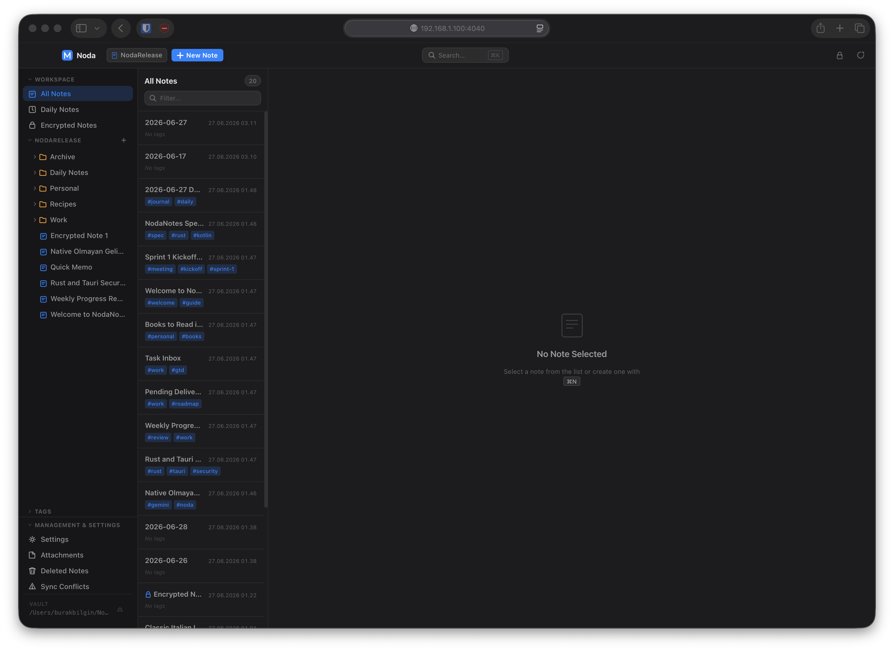
  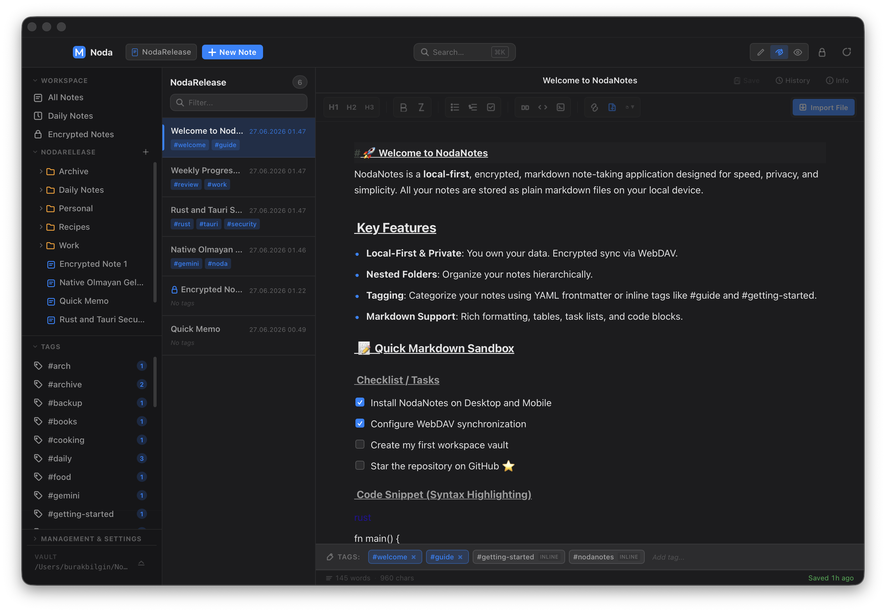
</p>
<p align="center">
  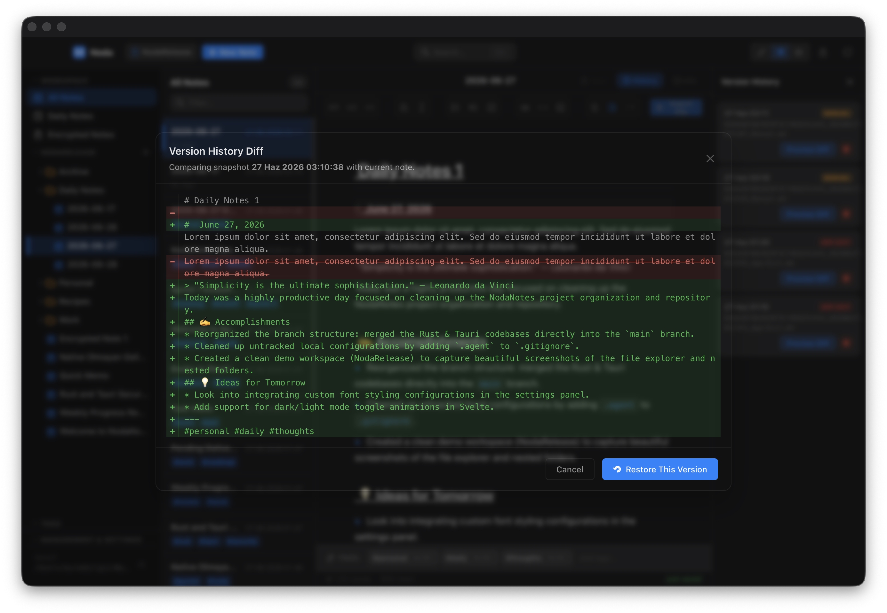
  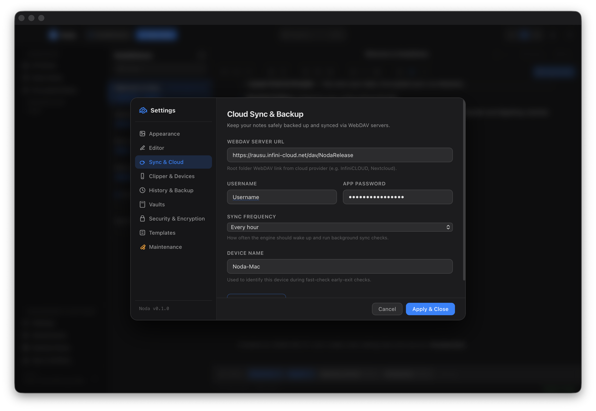
</p>

### 📱 Android Mobile App (Native Kotlin + Jetpack Compose)
<p align="center">
  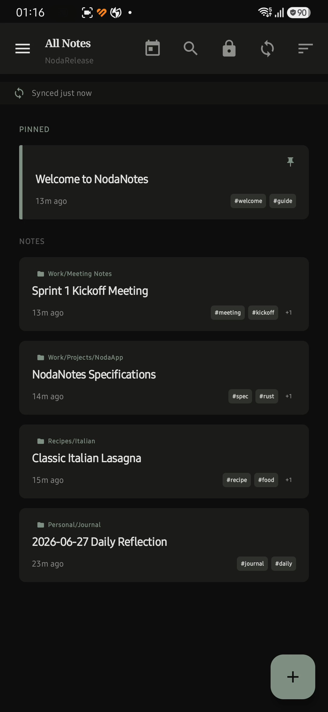
  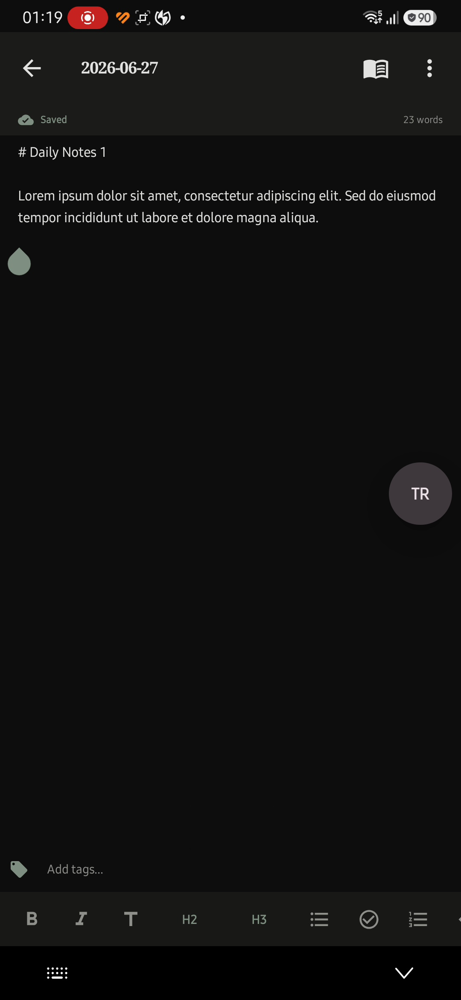
  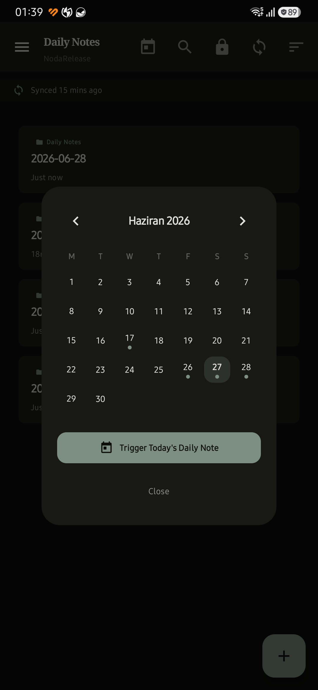
</p>
<p align="center">
  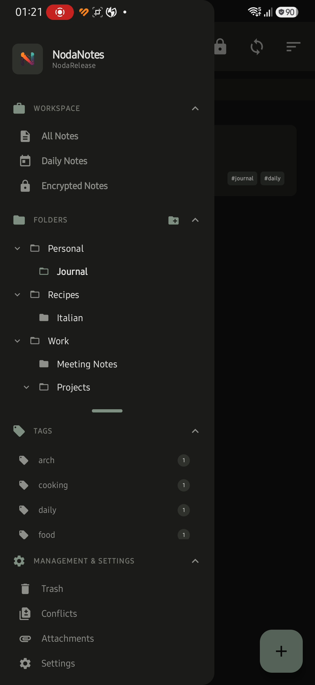
  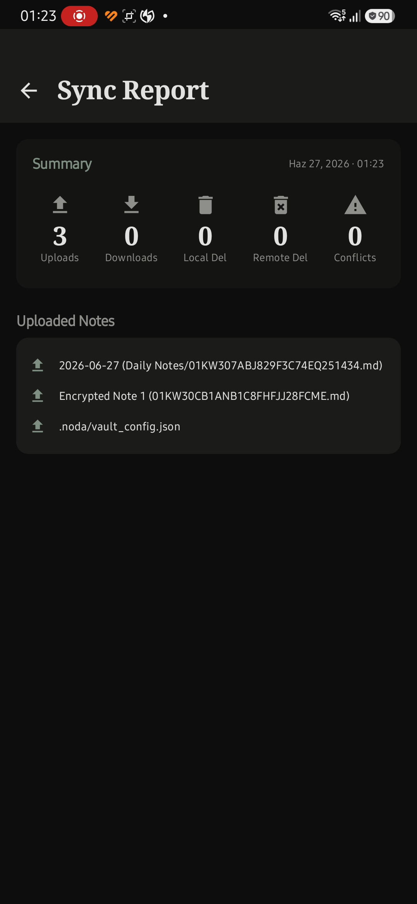
  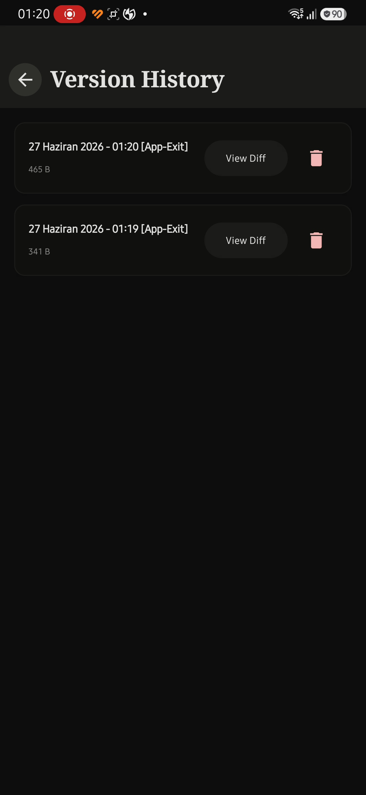
</p>

### 🧭 Safari Native Web Clipper Extension
<p align="center">
  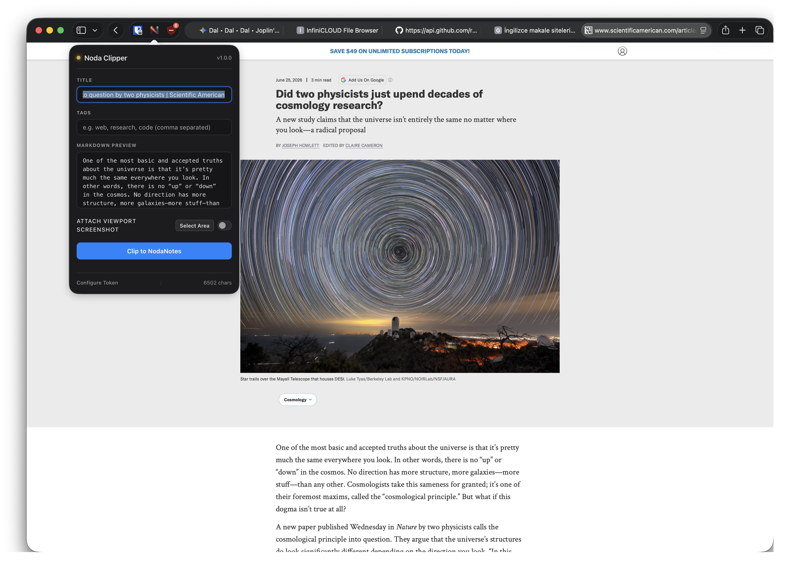
  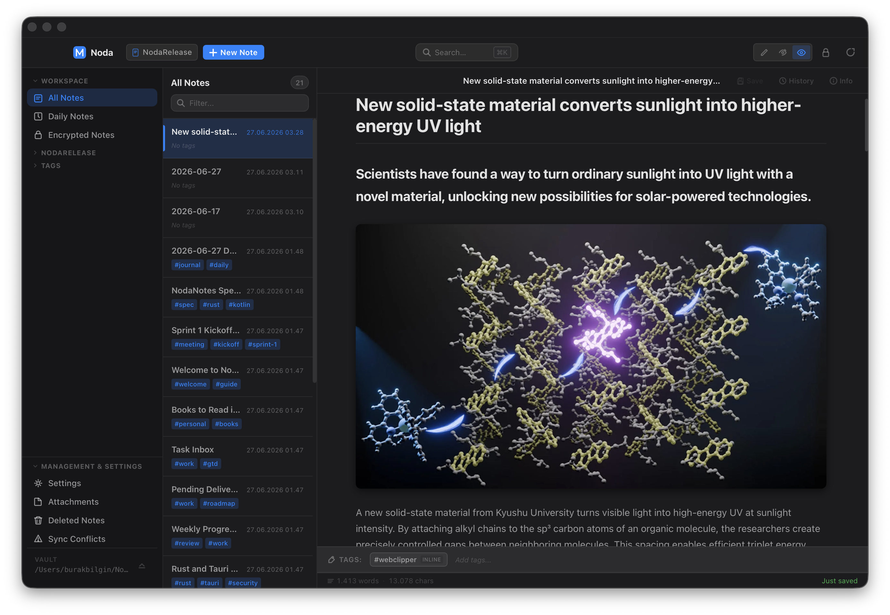
</p>

---

## 🏛️ System Architecture

NodaNotes is built on a **Rust-First, UI-Second** philosophy. The core business logic is entirely isolated in Rust, making the client apps thin, performant, and visual-only layers ("dumb monitors").

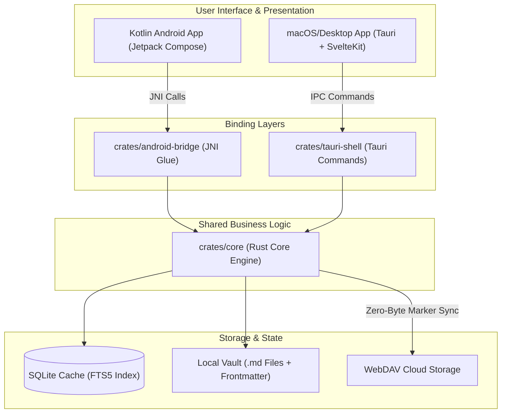

---

## ⚡ Key Technical Capabilities

### 1. Local-First & Markdown-First
- All notes are saved directly as raw `.md` files in a standard directory structure.
- Metadata (ULID IDs, title, created/updated timestamps, tags, pin status, and colors) is stored inside the note using YAML frontmatter.
- SQLite is strictly utilized as a cache and full-text index. If deleted, the cache automatically rebuilds from disk on startup in under 2 seconds.

### 2. Multi-Device Fast-Check Sync (Zero-Byte Protocol)
- Employs a custom WebDAV sync engine written in Rust.
- Utilizes the **Zero-Byte Marker Protocol** inside `.noda/sync/` to isolate self-sync footprints and prevent infinite loop conflicts common in WebDAV endpoints (e.g. InfiniCloud).
- Audits remote changes and determines synchronization updates in **0.1 seconds** on empty-run cycles.

### 3. Flat-File Version Snapshots
- Implements an independent version history saved as flat `.md` files under `.noda/history/`.
- Compares proposed snapshots against current file hashes to suppress duplicate entries and eliminate database bloat.
- Supports flexible and mandatory update matrices.

### 4. Native JNI & Multi-ABI Target Integration
- Shares the same Rust core on mobile via a high-performance JNI bridge.
- Employs runtime CPU architecture detection (`Build.SUPPORTED_ABIS`) and a 4-tier asset matcher to download, verify, and execute the correct architecture-specific update package seamlessly.

---

## 🛠️ Developer Setup & Compilation

### Prerequisites
- [Rustup](https://rustup.rs/) (targets: `aarch64-linux-android` for mobile, native host for desktop)
- Android SDK & NDK (for mobile JNI compiler)
- Node.js & Bun (for SvelteKit landing page & Tauri building)

### 1. Building the Rust Core
To compile the core library and run cargo tests:
```bash
# Test core functionalities
cargo test --manifest-path crates/core/Cargo.toml
```

### 2. Building & Installing the Android App
Compile the Rust JNI library and launch the debug package on your connected device:
```bash
cd android
# Set JAVA_HOME and install to debug device
JAVA_HOME="/Applications/Android Studio.app/Contents/jbr/Contents/Home" ./gradlew installDebug
```

### 3. Building the Desktop Client (Tauri)
To run the SvelteKit-powered desktop app in development mode:
```bash
# Start tauri development server
npm run tauri dev
```

---

## 📄 License
This project is licensed under the MIT License - see the LICENSE file for details.
